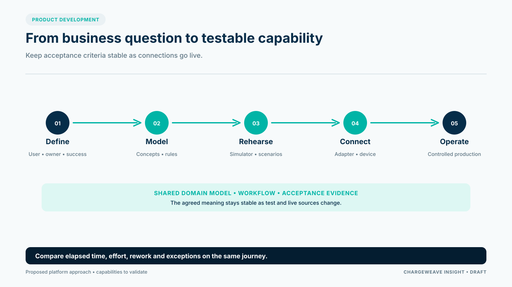

When a CPO plans a new software capability, the first instinct is often to name a system: CPMS, energy-management platform, billing engine or roaming integration. Those are useful boundaries, but customers experience a service journey, not the architecture diagram.

A product team can make better choices by beginning with the outcome the operator promises and tracing the information, decisions and handoffs required to deliver it.

## Choose one journey with a clear owner

A good starting point is a new-site launch. The CPO needs to configure a site, register its equipment, set an approved tariff, expose the location to drivers, verify that sessions work and confirm that operations can monitor the result.

Write down the acceptance criteria before development. For example: the site appears with the correct connector and price; a simulated driver can start and end a session; the session record reaches the operations view; and a missing approval prevents publication. These statements can be reviewed by a product owner and tested by the engineering team.

The same method works for operational journeys: investigate a failed start, reconcile a session, respond to a power limit or change a site's commercial configuration. Keep the scope narrow enough to measure, but include the handoffs that make the outcome real.

## Model meaning before multiplying connections

A shared business model should define the key concepts in the journey: site, charge point, connector, tariff, approval, session, meter value and settlement record. It should make their relationships and lifecycles clear. Source-specific labels belong at the boundary, with mappings that can be versioned and tested.

This does not mean every system needs one database or every partner must adopt one vocabulary. The purpose is to help teams interpret exchanged information consistently. A simulator and a live integration can use different implementations while preserving the business meaning that acceptance tests depend on.

## Rehearse the ordinary problems

A credible test environment needs more than a happy path. Include an unavailable connector, a duplicate message, a delayed partner response and a missing price approval. Make the scenario repeatable so a team can see whether a change improves the result or creates a regression.

A simulator does not replace production-scale testing, security review or commissioning. It lets teams test business behavior earlier, while live access or hardware is still being arranged. Later, the same acceptance criteria can be repeated through a partner sandbox and then a controlled production connection.

## Bound the role of AI

AI can help summarize an exception, find relevant evidence or propose the next step. It should not silently approve a tariff, override a grid limit or bypass an operating rule. The workflow should control what actions are allowed, while people retain responsibility for material decisions.

ChargeWeave's product direction combines a shared domain model, explicit workflows and testable scenarios so the AI has context and bounded responsibilities. The development value is a hypothesis to test: measure elapsed time, staff effort, rework, exceptions and the amount of integration logic reused on a matched journey.

Start with one journey and a baseline. If the platform cannot demonstrate a measurable improvement on a real CPO problem, broadened architecture will not rescue the business case.

## Sources

- Open Charge Alliance, OCPP: https://openchargealliance.org/protocols/open-charge-point-protocol/
- EVRoaming Foundation, OCPI: https://evroaming.org/ocpi/
