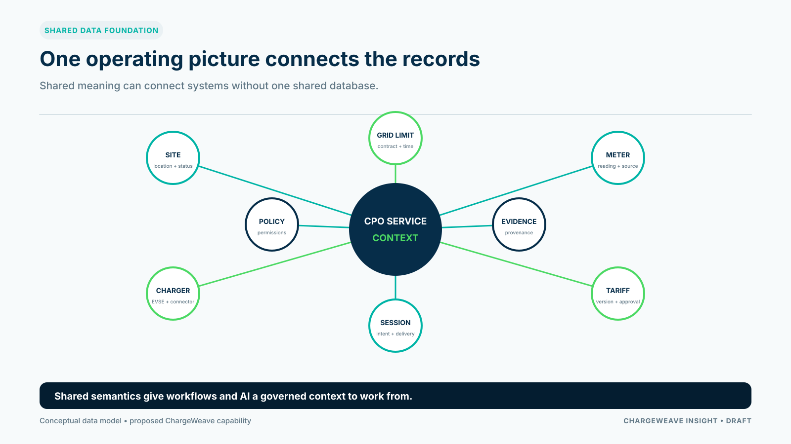

A charge point management system can monitor devices and sessions. A grid-aware CPO also needs to understand how each site's energy limit, charger group, customer requirements and commercial commitments fit together.

That operating view depends on more than collecting data. It requires shared meaning: a stable way to describe which asset a record belongs to, what a status means, when a value is valid, who owns the next action and what evidence supports a decision.

## Connect the records that describe one service

A site may have a grid connection, a contracted import limit, a meter, several charging stations and a fleet or public charging service. Each object may be managed in a different system. If the identifiers and definitions do not align, a CPO may struggle to answer simple operational questions: Which sessions were affected by a power constraint? Which tariff applied? Was a change approved? Did the actual load stay within the agreed envelope?

A useful data foundation connects these records without pretending they all come from one source. It retains provenance, effective dates and source-specific identifiers, while mapping them to consistent business concepts.

## Keep hard limits distinct from optimization goals

A grid connection or site control may impose a physical or contractual boundary. An energy price may provide a commercial signal. A vehicle departure target represents customer intent. Those are different kinds of information and should not be collapsed into a single “priority” score.

The CPO's system should distinguish what must never be exceeded from what can be optimized. It should also expose when all requested charging cannot fit within the available time and power. An optimizer that presents a polished schedule without identifying infeasible requirements gives operators a false sense of control.

## Design the evidence with the decision

For an important charging decision, retain enough information to reconstruct the outcome: the applicable site configuration, relevant measurements, customer requirements, active rules, workflow state and any human approval. Preserve corrections in a way that does not silently rewrite what the system knew earlier.

This makes incident analysis, settlement and customer communication more reliable. It also lets the CPO compare the planned schedule with what actually happened.

## A shared model can support AI, if the model is governed

AI systems can reason over operational data only as well as the context allows. A field named “available” may describe a connector, a site, a reservation or a power allocation. Without clear definitions and time context, an AI assistant may make an incorrect inference or produce a misleading explanation.

ChargeWeave's product direction is to use a modular domain model as a shared layer across workflows, interfaces, simulations and AI assistance. It should have business stewards, versioning, change impact checks and acceptance scenarios. The model is not a substitute for operational data quality or authorization.

For CPOs, the value test is practical: can the shared foundation reduce the effort to onboard a site, explain a constraint, reconcile a session or test a new connection? Measure those outcomes before describing the architecture as a business benefit.

## Sources

- Open Charge Alliance, OCPP: https://openchargealliance.org/protocols/open-charge-point-protocol/
- EVRoaming Foundation, OCPI: https://evroaming.org/ocpi/
