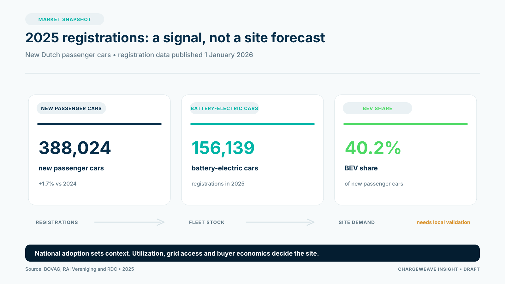

The 2025 passenger-car figures offer CPOs a useful starting point for 2026 planning. BOVAG, RAI Vereniging and RDC reported 388,024 new passenger cars registered in the Netherlands in 2025, 1.7% more than in 2024. Battery-electric cars accounted for 156,139 registrations, or about 40% of the total.

Those figures show meaningful demand. They do not tell an operator where a new charging site will be viable, how quickly a grid connection can be delivered, or whether a given location will generate a reliable return. A national registration total is a market signal, not a site plan.

## Separate fleet growth from deliverable business

CPO planning needs several layers of evidence. The size and composition of the vehicle fleet affect long-term charging demand. Local parking patterns and charging access influence where that demand appears. Utilization, tariffs, electricity costs, connection capacity and operating costs determine whether a specific asset can serve it profitably.

These measures should not be conflated. New-car registrations are a flow during a year; the vehicle fleet is a stock accumulated over many years. A share of new cars is not the same as the share of all vehicles on the road. Neither figure directly measures charging sessions, energy delivered or revenue per site.

A disciplined plan therefore asks what the 2025 registrations imply for customer segments, then tests each segment against local conditions. Public curbside charging, workplace charging, a fleet depot and a highway fast-charging hub have different dwell times, energy needs, connection costs and buyers.

## Build scenarios around decisions

Use market data to create planning ranges rather than a single confident forecast. Ask what happens if adoption grows more slowly, if the mix of home and public charging changes, or if connection delivery lags demand. Identify which product and commercial choices remain sound in each case.

For every candidate site or customer segment, track the assumptions that affect the decision: expected utilization, number of charge points, available capacity, operating hours, support burden, pricing and contract duration. Keep observed data separate from assumptions. A model is most useful when a customer can see which inputs would change the recommendation.

## Turn market planning into an operating model

CPOs also need a way to connect market assumptions to live operations. If the business expects fleet growth but cannot connect the fleet schedule to energy constraints, charger availability and departure needs, the forecast will not translate into service performance.

ChargeWeave's product direction is to provide a shared account of those concepts and their relationships. That could let commercial, operations and engineering teams reason from the same site, asset, tariff, session and obligation definitions. It is a proposed capability, not a claim of current production functionality.

The 2025 registrations justify taking the market seriously. The next step for a CPO is more specific: identify the customer problem, validate the local conditions and measure whether the operating service can meet its promise.

## Sources

- BOVAG, “Autoverkoop stabiel in 2025,” 1 January 2026: https://www.bovag.nl/pers/persberichten/autoverkoop-stabiel-in-2025
- European Alternative Fuels Observatory, Netherlands market data: https://alternative-fuels-observatory.ec.europa.eu/transport-mode/road/netherlands
