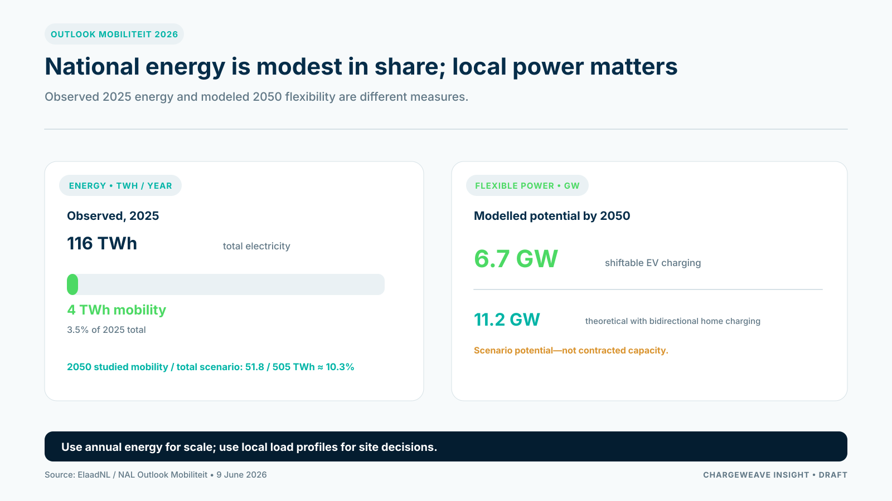

The first Outlook Mobiliteit from ElaadNL and the National Charging Infrastructure Agenda, published on 9 June 2026, brings electric mobility demand and grid impacts into one national assessment. It estimates 51.8 terawatt-hours of demand in 2050 for the vehicle categories studied. Against Netbeheer Nederland’s middle scenario of 505 terawatt-hours of total electricity use, mobility would account for just over 10%. These are scenario figures, not measured outcomes or guarantees. The outlook’s message for CPO planning is that national energy demand is only part of the story: local timing and concentration determine where the network feels pressure.

ElaadNL also reports that Dutch electricity use in 2025 was about 116 terawatt-hours, with roughly 4 terawatt-hours attributed to electric mobility. Those figures provide scale, but they do not mean that charging can be placed anywhere without a capacity problem. Energy consumed over a year and power drawn simultaneously at a constrained location are different measures.

## Distinguish energy from power

Energy, measured in kilowatt-hours or megawatt-hours, describes consumption over time. Power, measured in kilowatts or megawatts, describes the rate at which energy is delivered at a moment. A CPO can face a local power constraint even when the charging sector's annual energy demand looks modest compared with national electricity use.

The relevant operational questions are therefore local: when do vehicles arrive, how long do they stay, what energy do they need, and what capacity is available during those periods? ElaadNL calculated that shifting suitable sessions outside the weekday 16:00–21:00 peak could offer up to 6.7 GW of flexible capacity in 2050; including bidirectional home charging raised the theoretical potential to 11.2 GW. These are modelled potentials dependent on technology, participation and interoperability—not capacity a CPO can assume is already contracted. A site with predictable dwell time may shift part of its charging. A high-turnover location may have less flexibility. A fleet depot may need to protect specific departures.

## Use forecasts as planning inputs, not site guarantees

The Outlook is a modelled assessment. Its scenarios can help public authorities, grid operators and CPOs understand possible infrastructure requirements, but a national forecast is not a promise that a specific connection will be available by a certain date.

For site decisions, combine the outlook with local grid data, connection agreements, site measurements and operational requirements. Keep assumptions visible and test sensitivity to utilization, charging profiles, efficiency, weather and customer behavior.

## Turn constraints into explicit operating logic

A grid-aware energy management system needs accurate asset identity, current limits, customer intent, forecasts and control acknowledgements. It should check whether charging requirements are feasible, produce a schedule, send commands through an authorized path and compare actual delivery with the plan.

It also needs a fallback when data is late, connectivity fails or conditions change. Keep physical protection and validated site controls separate from commercial optimization. An AI assistant may explain a constraint or recommend a response, but the approved policy and control path should determine what action is allowed.

ChargeWeave's direction is to connect these ideas through a shared description of sites, assets, limits, sessions and service obligations. That model is a foundation for product development; performance and financial benefits still need to be proven in customer pilots.

## Sources

- ElaadNL, “Dutch Study Maps Expected Growth in Electric Mobility and Grid Impacts,” 9 June 2026: https://elaad.nl/en/dutch-study-maps-expected-growth-in-electric-mobility-and-grid-impacts/
- ElaadNL, Outlook Mobiliteit: https://outlook.elaad.nl/rapport
