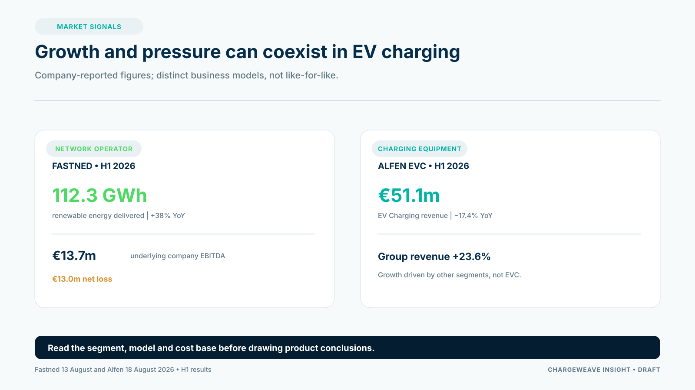

The first-half results published by Fastned and Alfen in August 2026 offer two different views of value capture in the charging market. Fastned reported strong growth in delivered energy and charging-related revenue, alongside a net loss. Alfen reported a decline in electric-vehicle charging revenue. Together, the results are a reminder that market growth does not translate into the same economics for every charging business.

Fastned's 13 August update reported 112.3 gigawatt-hours of renewable energy delivered in H1 2026, up 38% year on year, and underlying company EBITDA of €13.7 million. Its net loss was €13.0 million. Alfen's 18 August H1 report showed electric-vehicle charging revenue of €51.1 million, down 17.4% year on year.

These are company-reported figures from different business models. Fastned operates a public fast-charging network; Alfen sells charging products and systems. The numbers cannot be compared as if they were the same unit economics or the same customer proposition.

## Growth has to be connected to the cost base

For a network operator, utilization and energy throughput can improve the economics of existing sites, while new locations require capital, grid access, construction and operating support. For an equipment and software supplier, revenue depends on orders, competition, product mix, delivery costs and the ability to provide repeatable implementations.

CPOs evaluating software or services should ask where the measurable value appears. Does a product improve successful sessions, reduce support time, increase utilization, lower energy costs or shorten commissioning? Who captures that value—the operator, site host, fleet customer, energy supplier or service provider?

A product that saves energy but requires extensive bespoke integration may not produce attractive net economics. A platform subscription with a low price but heavy onboarding and support can also disappoint.

## Treat each product thesis as an investment case

For every proposed CPO product, define:

- the buyer and the operating problem;
- the customer baseline and measurable outcome;
- the implementation cost and repeatability;
- the data and permissions required;
- the route to recurring revenue;
- the conditions that would stop or change development.

This is particularly important for advanced energy management. Grid constraints create a reason to investigate flexibility, but they do not establish that every CPO can sell a profitable flexibility service. The customer needs authority, reliable data, compatible controls and a contract that makes the service valuable.

## ChargeWeave's commercial proof

ChargeWeave's product direction is to connect operating data and business workflows so that CPO teams can test propositions against complete journeys. For example, a site-launch or session-reconciliation pilot could track elapsed time, human effort, exceptions and avoided rework. Those measures create a more defensible case than claiming generic AI productivity.

The market signals justify focused product development, not a forecast of automatic growth. Use customer evidence to decide what is worth building, what should be integrated through partners and what should remain a hypothesis.

## Sources

- Fastned, H1 2026 results, 13 August 2026: https://www.fastnedcharging.com/hq/en/fastned-sees-underlying-company-ebitda-accelerate-to-137m-in-h1-2026-vs-14m-in-h1-2025-and-updates-guidance
- Alfen, H1 2026 results, 18 August 2026: https://www.alfen.com/en-ch/investor-relations/investor-relations-news/alfen-reports-h1-2026-results-in-line-with-expectations-while-advancing-its-transformation
