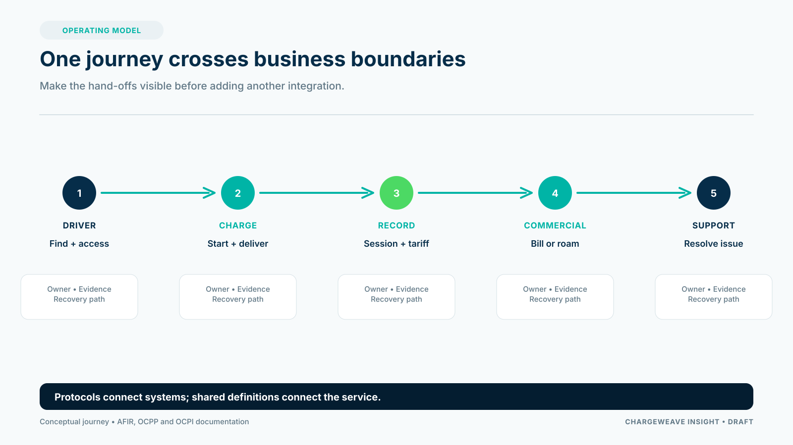

A charge point is visible. The service behind it is not. Drivers experience a location, a price, an access method, an energy session and the support they receive when something fails. CPO teams manage the systems and partners that make those pieces work together.

Thinking in journeys helps reveal where a charging platform creates value. It also gives a better starting point for product development than a list of screens or integrations.

## Map the journey from intent to settlement

Consider a driver who needs to charge before a later trip. The service has to answer a sequence of connected questions:

1. Can the driver discover a usable point at the right location?
2. Is the connector compatible and available?
3. Is the price clear and approved?
4. Can the driver authenticate and start?
5. Does the charger deliver energy and report the session accurately?
6. Does the session reach the correct billing, roaming or fleet record?
7. Can the CPO investigate and resolve an exception?

Each step crosses a boundary. The charge point may be managed by one system, the driver by another, the roaming exchange by a third and the financial settlement by a fourth. A successful charging service depends on their shared meaning and the handoffs between them.

## Make ownership visible

A journey map should name who owns each decision. Who approves a tariff? Who may change a connector's status? Which organization investigates a disputed session? Who tells the driver what happened? If ownership is unclear, software can make the confusion faster without making the service better.

For each step, record the business information required, the actor responsible, the expected result, the evidence retained and the recovery path. Include ordinary failures: late or duplicated messages, unavailable partner services, corrected meter values and changed permissions.

This creates a usable backlog. Instead of “integrate roaming,” a team can define a testable outcome: a valid session record received from a partner is linked to the right site, tariff version and settlement status, and an exception is assigned when one of those links is missing.

## Treat standards as contracts to test

Open protocols can support equipment and partner interoperability, but they do not eliminate implementation differences. The CPO still needs a compatibility profile, version control, monitoring and end-to-end acceptance tests. A test should include the charger or partner systems that will be used, not just a successful schema exchange.

The same principle applies to charging data. A record is useful only when teams agree on what it describes, how its state changes, when it is considered final and how a correction is represented.

## The ChargeWeave thread

ChargeWeave's direction is to make these relationships explicit in a shared domain model. A site, connector, tariff, authorization, charging session and settlement record should be connected through defined concepts and workflows. The model can then inform user journeys, validations, simulations and acceptance scenarios.

The purpose is not to force every partner into one database or vocabulary. It is to reduce repeated translation at the boundaries and give teams a stable account of the service they are building.

A CPO can start small: map one high-friction journey, such as a failed public session or a new-site launch. Agree on what success means, rehearse the normal path and a few exceptions, then compare the result with current operations. That gives the business a concrete basis for deciding what to build next.

## Sources

- Open Charge Alliance, OCPP: https://openchargealliance.org/protocols/open-charge-point-protocol/
- EVRoaming Foundation, OCPI: https://evroaming.org/ocpi/
- European Union, Regulation (EU) 2023/1804: https://eur-lex.europa.eu/eli/reg/2023/1804/oj
