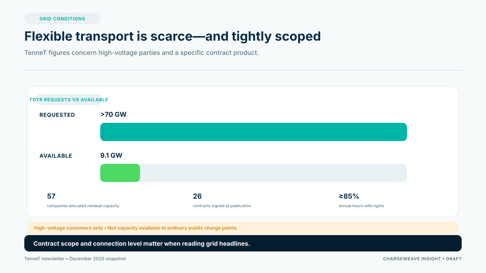

National charging demand can grow while the decisive constraint remains highly local. A CPO may have a strong customer case and a suitable site, yet still face uncertainty about connection timing, transport capacity or the conditions under which new demand can be added.

Recent Dutch examples show why operators need to assess the grid at the location and contract level. Stedin describes transport scarcity in parts of Utrecht, where new or heavier connections from 1 July 2026 depend on network expansion or capacity becoming available through more flexible use. Liander reported on 16 September 2026 that the new Rozenburg-Zuid electricity station would create additional capacity around Schiphol.

TenneT's December 2025 account of its high-voltage queue gives another useful scale marker. It reported that more than 70 GW of time-dependent transport-right requests had been made against 9.1 GW of available capacity. TenneT said it allocated remaining capacity to 57 companies, with 26 contracts signed at the time of publication. The product allowed transport rights for at least 85% of annual hours, with possible restrictions in the remaining hours. These figures describe high-voltage connected parties and a specific contract product; they are not a measure of capacity available to ordinary public charging points.

## Ask what “capacity available” means

For each site, distinguish the physical connection, contracted transport capacity, local distribution constraints, upstream dependencies and any flexibility product or agreement. Confirm which limit applies at which times, who can change it and what evidence the CPO receives.

Do not assume that installing storage, a larger charger or an EMS automatically creates a right to draw more power. The product must operate within the applicable connection and transport arrangements, and the commercial agreement must state how flexibility is requested, measured and compensated.

## Build a site decision record

A CPO site record should include the grid operator, connection status, agreed limits, effective dates, application milestones, available alternatives and dependencies. Link those facts to expected charging demand, commissioning tasks and customer commitments.

That makes it possible to compare a location with other options. A delayed site might be phased, redesigned for lower initial load, paired with controllable charging or deferred until capacity improves. Each choice has trade-offs in capital, service quality, utilization and customer experience.

## Use AI for explanation, not permission

An AI assistant could summarize a site's status, identify missing information or explain which assumptions affect a proposed charging plan. It should not invent available capacity or treat a probability estimate as a connection commitment. The source record, contract and authorized workflow determine what the operator may do.

ChargeWeave's platform direction is to link grid agreements, site assets, operational limits, customer needs and evidence in one traceable model. A CPO could use that foundation to rehearse a site launch, compare scenarios and track the approvals that remain. This is a capability to validate, not a guarantee of access to grid capacity.

The practical lesson is simple: qualify the local constraint early, keep the source and effective date visible, and make the impact on the charging service explicit.

## Sources

- Stedin, “Transportschaarste voor afname in Utrecht”: https://www.stedin.net/zakelijk/energietransitie/beschikbare-netcapaciteit/congestie-en-congestiemanagement/provincie-utrecht/transportschaarste-afname
- Liander, “Nieuw elektriciteitsstation Rozenburg-Zuid vergroot ruimte op stroomnet rond Schiphol,” 16 September 2026: https://www.liander.nl/over-ons/nieuws/2026/nieuw-elektriciteitsstation-rozenburg-zuid-vergroot-ruimte-op-stroomnet-rond-schiphol
- TenneT, “Opschonen wachtlijsten en afsluiten TDTR contracten,” December 2025: https://magazines.tennet.eu/nieuwsbrief-netcongestie-december2025/opschonen-wachtlijsten-en-afsluiten-tdtr-contracten
