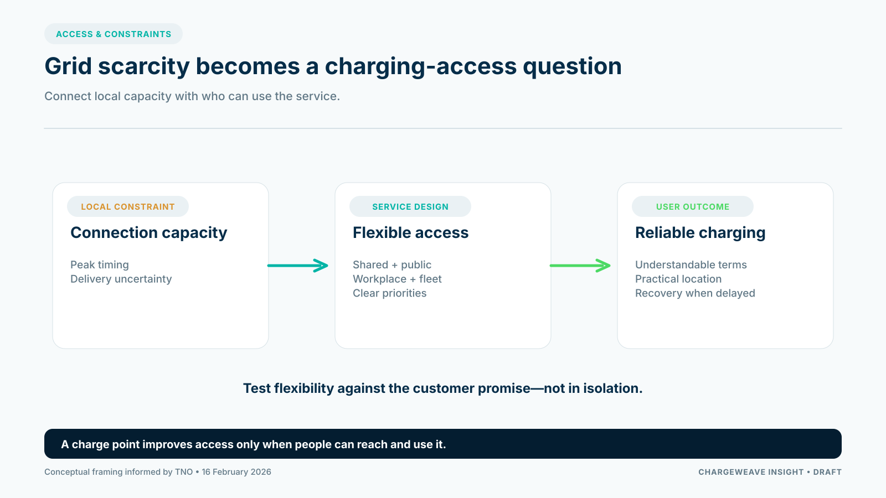

Grid congestion is often discussed as a connection problem for companies. For electric mobility, it is also a question of who can charge, where, and with what level of certainty.

In its 16 February 2026 analysis, TNO connected flexibility and grid resilience with the mobility transition and highlighted distributional effects. Those effects matter to CPOs because drivers do not have equal access to private parking or home charging. If a service assumes every driver can charge at home, it may miss the people who depend most on public or shared infrastructure.

## Capacity is local; access is personal

A national growth forecast cannot tell a CPO whether a particular neighborhood can support a new public charging project. Local grid conditions, connection availability, parking access and the practical ability to install equipment shape the service.

A CPO should therefore assess more than the requested power. Who needs the charging service? Is the site usable by those drivers? How far must they walk? Are there parking rights or restrictions? Is there a realistic alternative if the preferred site is delayed? A charger that is technically installed but inaccessible to its intended users does not solve the service problem.

## Flexibility can help, but it must be designed around a promise

Managed charging can shift some load away from constrained periods. But a CPO cannot treat flexibility as an abstract amount of power. It needs to understand which sessions can move, which customer requirements are firm, what notice can be given and what happens when a plan becomes infeasible.

For a fleet, a departure deadline may define the service. For a public driver, predictable access and clear information may matter more than a small energy-price optimization. A useful control policy must make these priorities visible and handle exceptions fairly.

CPOs should document the constraints attached to a site: the connection limit, operational hours, applicable contracts, local control capabilities and customer commitments. Then they can test whether managed charging preserves the service under realistic conditions.

## Design for people who lack private charging

Shared residential charging, workplace access and public charging can serve different needs. Each requires coordination among different decision makers: property owners, residents, employers, municipalities, installers and network operators. CPO products should make that coordination easier rather than assume the charger alone is the product.

The platform challenge is to connect access rules, site capacity, user eligibility, pricing, sessions and support responsibilities in one understandable journey. ChargeWeave's proposed shared model could help teams define these relationships once and test the outcomes before relying on a live connection. It remains a product direction to validate with CPOs, not a claim that all such workflows are already available.

The key question for operators is not simply how much flexibility can be offered. It is how to deliver dependable access while respecting the limits of the grid and the needs of drivers.

## Sources

- TNO, “From grid congestion to resilience: flexibility accelerates the mobility transition,” 16 February 2026: https://www.tno.nl/en/newsroom/insights/2026/02/grid-congestion-mobility-transition/
- European Commission, Alternative Fuels Infrastructure Regulation: https://eur-lex.europa.eu/eli/reg/2023/1804/oj
