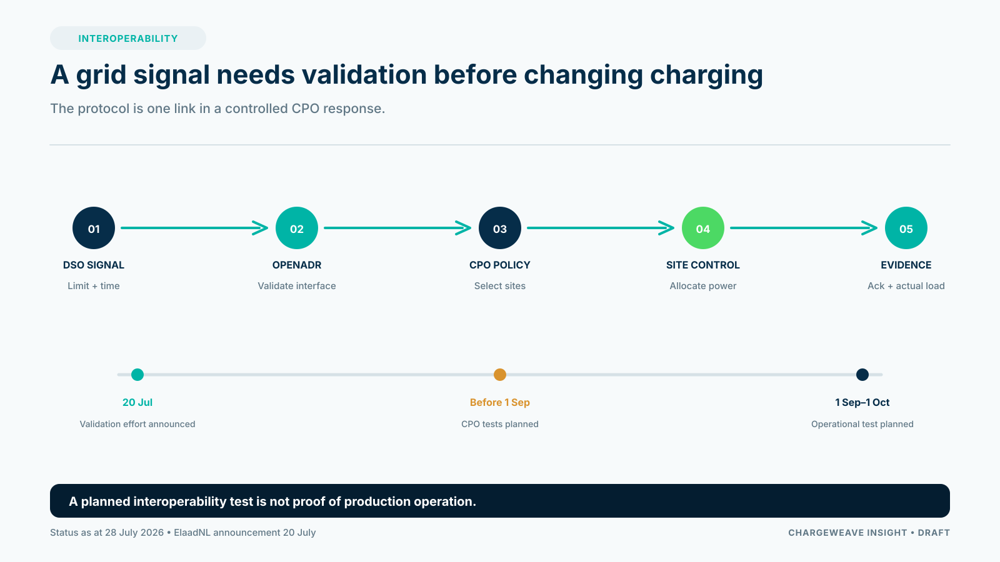

A grid signal is not yet a charging strategy. A CPO needs to translate an external request or constraint into a decision about sites, vehicles, customer promises and authorized control actions.

On 20 July 2026, ElaadNL described its OpenADR 3 validation effort for dynamic grid-aware charging. CPOs were expected to submit implementations for testing before the planned operational test phase from 1 September to 1 October. At the date of this proposed article, those tests were still ahead. The announcement is a useful interoperability milestone, but it does not prove that every charger, CPO platform, site controller and network operator is ready for production.

## Separate communication from the operating decision

OpenADR can provide a way for systems to communicate demand-response information. The CPO still needs to determine what that information means for its own portfolio. Is the signal informational or binding? Which sites are eligible? How long does it apply? What limits remain in force? Which customer requirements can be shifted?

These questions belong in a versioned operating policy. The platform should identify the affected assets, check local configuration and customer needs, calculate feasible options, record the decision and send any command through an authorized control path.

## Measure service alongside peak reduction

A flexibility program can reduce load during a targeted period, but the CPO also needs to understand the service impact. Did drivers still receive the energy they needed? Were fleet departures protected? How many sessions were delayed or curtailed? What compensation or customer communication applied?

Stedin's Utrecht winter pilot, reported on 7 July 2026, found that temporarily reducing charging speeds at roughly 3,500 public charge points during the evening peak reduced peak load by up to 49.5% in the pilot comparison. That is evidence from a defined intervention and period. It should not be presented as a universal result for every network, site or control strategy.

A CPO should report the baseline, time window, participating assets, customer safeguards and rebound behavior. One headline percentage is not enough to assess a commercial service.

## Make interoperability testable

Acceptance testing should include the full chain: grid signal, platform interpretation, site controller, charger response, meter or telemetry feedback, exception handling and recovery. Test delayed, duplicate and malformed messages. Verify that stale signals expire and that local safety limits remain active.

The CPO should also retain the signal, the policy version, the affected assets, the schedule, commands and acknowledgements. That evidence supports customer explanations and settlement.

## Where ChargeWeave could help

ChargeWeave's product direction is to connect grid constraints, site assets, customer requirements and workflow responsibilities in a shared model. That could make it easier to simulate a flexibility event before a live connection, compare operating policies and explain why a site did or did not respond.

The capability is a roadmap hypothesis. A CPO pilot should measure communication reliability, control accuracy, energy delivered, customer impact, operational effort and commercial value before scaling.

## Sources

- ElaadNL, “ElaadNL test implementatie OpenADR voor dynamisch netbewust laden,” 20 July 2026: https://elaad.nl/elaadnl-test-implementatie-openadr-voor-dynamisch-netbewust-laden/
- Stedin, “Netbewust laden vermindert piekdruk op stroomnet tot 49,5 procent,” 7 July 2026: https://web.stedin.net/over-stedin/pers-en-media/persberichten/netbewust-laden-vermindert-piekdruk-op-stroomnet-tot-495-procent
