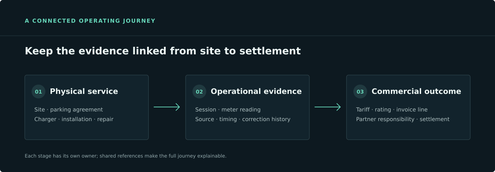

A public map can show where chargers are. It cannot tell an operator whether a location is ready to open, whether a service partner has accepted a repair, or whether a completed session can be explained on an invoice. Those answers live across the operating journey.

That distinction matters as charging networks grow. Every location brings physical equipment, agreements, maintenance, energy constraints, customer expectations and financial responsibilities. Treating those as disconnected records makes routine questions harder: what happened, who owns the next action, and what evidence supports the outcome?

## Connect the physical and commercial views

A charger is part of a site, but the site is also a business relationship. An installation partner may commission the equipment. A parking-site owner may set access conditions. A mobility service provider may bring the driver. The charge point operator coordinates the service and is accountable for the network experience.

Each party sees a different part of the work. A useful operating model keeps those responsibilities distinct while linking them to the same site, asset and event history. That gives teams a way to follow a fault from its first signal through assignment, repair, verification and return to service.

The same connected view helps finance. A metered session is evidence of energy delivered; a tariff and its conditions determine how that usage is rated; a commercial agreement determines what is owed by whom. Keeping those facts linked makes billing and later reconciliation easier to investigate.

## Preserve evidence as the work moves

Operational systems often receive information late or more than once. A meter reading may arrive after a session ended. A partner may resend a message. A correction may apply to an earlier business date. If the system overwrites the old value, it becomes difficult to reconstruct what the operator knew when a decision was made.

Instead, retain the source, timing and relationship of each important assertion. Link a correction to the record it supersedes, and represent financial adjustments as new, traceable outcomes. This lets operations and finance explain a decision without pretending that the original record never existed.

## Make the next action clear

Not every exception should be resolved automatically. A human may need to review meter evidence, confirm a repair, or correct a commercial detail. The work surface should present the business task, the relevant evidence and only the inputs needed for that decision. A workflow can coordinate assignment and deadlines; the service responsible for the data should still validate and authorize the actual change.

This is a practical design test for a charging platform: can a team move from an event to an accountable action, then to a verified operational and commercial result, while keeping the evidence connected?

The network becomes easier to run when the charger is not treated as the whole story. Sites, people, service events, energy, sessions and settlement all need their own clear responsibilities—and links that let teams see how the work fits together.
