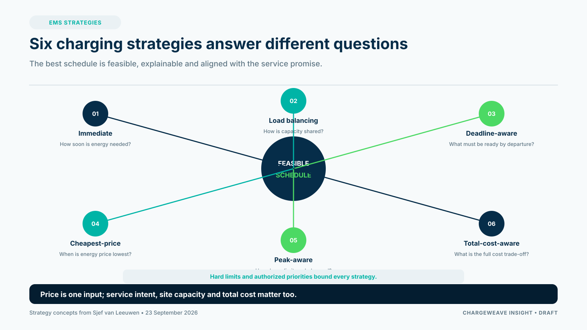

An energy management system for EV charging is often described as a price optimizer: charge when electricity is cheap and reduce load when it is expensive. That is one useful strategy, but it is not enough to describe the operating job of a CPO.

The system also has to respect site limits, vehicle needs, departure times, service commitments and the quality of the data used to make a decision. The cheapest schedule is not a good schedule if a fleet vehicle leaves without the energy it needs or if the plan assumes capacity that the site does not have.

In my article, “Smart Charging. Beyond the Price,” I describe six approaches: immediate charging, load balancing, deadline-aware charging, cheapest-price charging, peak-aware charging and total-cost-aware charging. They answer different questions. The right strategy depends on the operating context and the service promise.

## Treat strategy as a policy choice

Immediate charging prioritizes prompt energy delivery. Load balancing shares available power across active demands. Deadline-aware charging works backward from a required departure. Cheapest-price charging follows an energy-price signal. Peak-aware charging limits demand during selected high-load periods. Total-cost-aware charging considers a broader cost picture than the spot price alone.

These strategies can conflict. A CPO may need to protect a departure while respecting a site limit and responding to an expensive interval. An EMS should make those priorities explicit rather than hide them in a single score.

A robust decision process should:
1. validate the identity and freshness of charger, meter and vehicle data;
2. load the applicable site limits and customer requirements;
3. determine which requests are feasible;
4. produce a schedule with visible assumptions;
5. send authorized commands and record acknowledgements;
6. compare actual delivery with the plan and escalate exceptions.

## Do not confuse a simulation with a field result

A workplace-charging simulation can help explain how strategies behave under controlled assumptions. It is useful for comparing scenarios, showing trade-offs and generating questions for a pilot. It does not prove that the same energy savings, peak reductions or customer outcomes will occur at a real site.

A field pilot should use a defined baseline and representative operating period. Measure energy delivered, requirement fulfilment, peak demand, user overrides, infeasible departures, exceptions, support effort and cost. Record the weather, occupancy, tariffs and connection limits that influence the result.

## Where the AI platform fits

AI can help forecast demand, explain why a vehicle may miss its target, detect unusual patterns or summarize the evidence behind a recommendation. The workflow and control policy should still decide which action is allowed. Hard limits, permissions and approved customer priorities should remain explicit and testable.

ChargeWeave's product direction is to give the EMS a shared business context: sites, assets, energy constraints, schedules, tariffs, decisions and evidence connected through a common model. That could make scenarios easier to simulate and outcomes easier to explain across product, operations and engineering teams. It is a roadmap capability to prove in pilots, not a claim that every integration or control function is already built.

For CPOs, “smart” charging is not merely the lowest-price schedule. It is the best feasible service under the actual constraints—and a clear explanation when the requested service cannot be delivered.

## Sources

- Sjef van Leeuwen, “Smart Charging. Beyond the Price,” 23 September 2026: https://www.linkedin.com/pulse/smart-charging-beyond-price-sjef-van-leeuwen--mjpbe/
- ElaadNL, “Dutch Study Maps Expected Growth in Electric Mobility and Grid Impacts,” 9 June 2026: https://elaad.nl/en/dutch-study-maps-expected-growth-in-electric-mobility-and-grid-impacts/
- Stedin, “Netbewust laden vermindert piekdruk op stroomnet tot 49,5 procent,” 7 July 2026: https://web.stedin.net/over-stedin/pers-en-media/persberichten/netbewust-laden-vermindert-piekdruk-op-stroomnet-tot-495-procent
