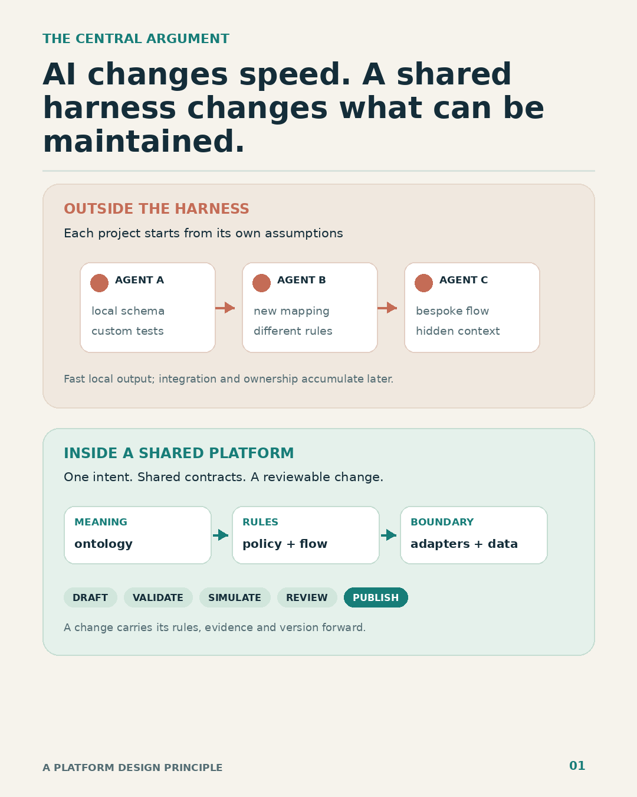
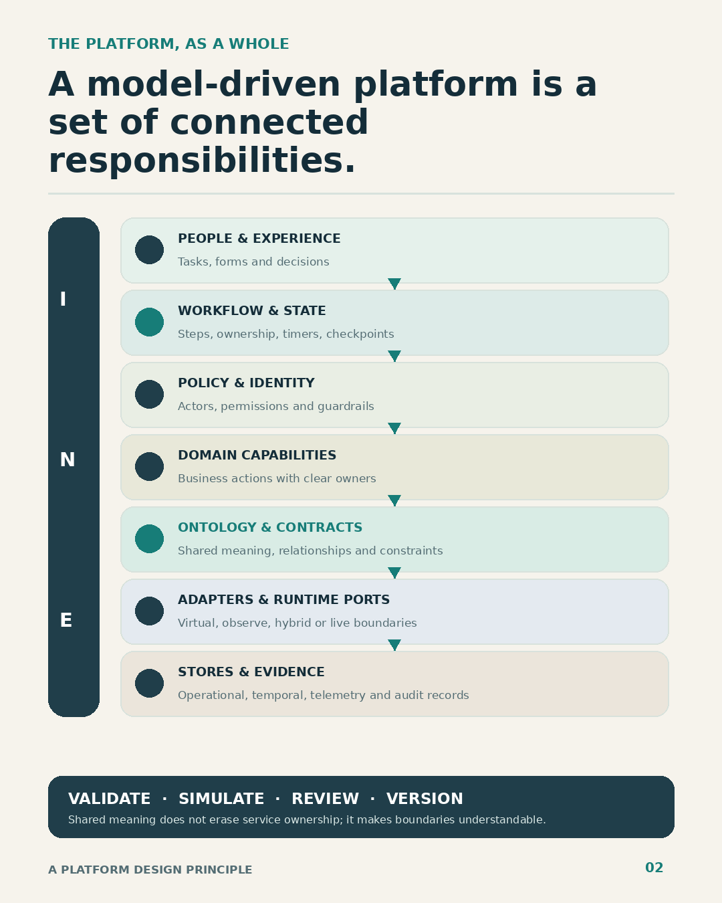
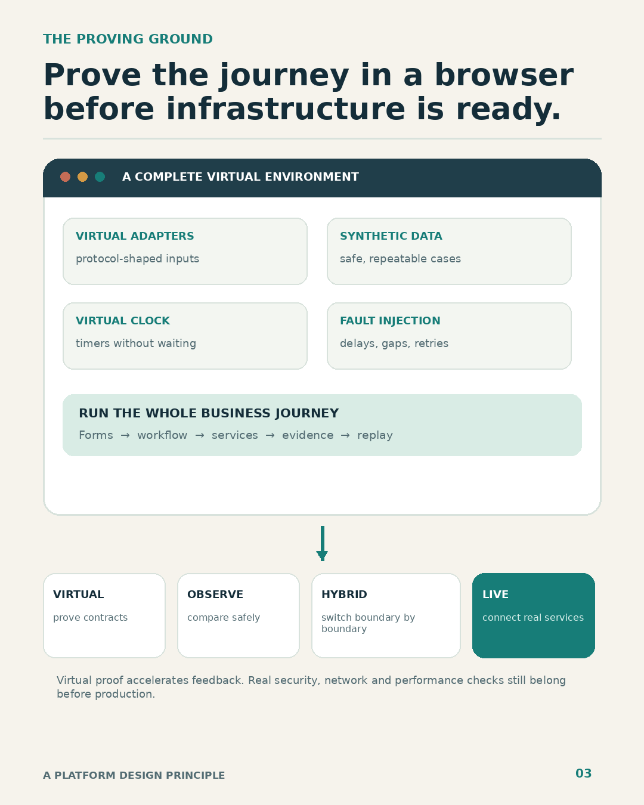
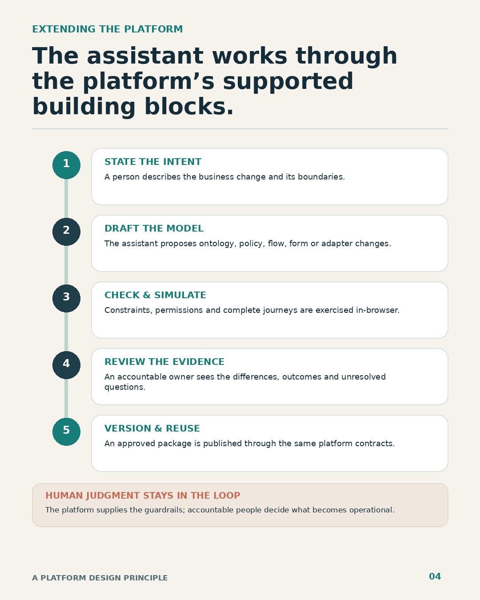

When people discuss AI and software, the question is often how quickly an assistant can write code. That matters. But the deeper question is what happens after the code is generated: can another team understand it, can the change be tested before live systems are available, and can it be adapted without starting over?

The answer depends on where the assistant works. If every agent creates its own schemas, rules, integrations and tests, local speed can become system-wide complexity. Inside a shared platform, AI works against common business meaning, policies, workflows, forms, adapters, simulation and evidence—the same contracts that govern the running system.

## From generated code to a maintainable change

Code generation can produce a useful first version. But a business capability also depends on the meaning of its information, the decisions it may make, ownership of each action, external dependencies and evidence that the result works.

Outside a shared harness, assumptions are recreated project by project. Agents may use different representations, duplicate policies or tests that prove only one implementation. The work can look complete while connections between teams and systems remain unfinished.

Inside a platform, an assistant can draft a change against shared building blocks. Checks validate its relationships and constraints, a virtual runtime exercises it, and an accountable owner reviews the differences before publication. Generated code may still be part of the result, within a system with known responsibilities.

## A platform is a set of connected responsibilities

A model-driven platform does not make one ontology the database, workflow engine and application. The ontology provides shared meaning and constraints; domain services own business actions and writes. Policies and identity define who may act. Workflow and state coordinate assignments, waiting, deadlines and checkpoints.

Human tasks fit here too. A task-specific form can use the workflow contract and model terms to show needed context and evidence; the responsible service validates and applies the change. Adapters translate external protocols, while separate storage boundaries retain operational records, temporal history, telemetry and evidence.

Together, shared meaning helps workflows ask for the right information, policy limits who can submit it, domain services validate changes, and the runtime records outcomes. Sharing a model does not mean every layer owns every concern.

## Prove the journey before the live connections

A particularly useful property is the ability to run a complete virtual environment in a browser. It can contain virtual adapters that speak expected protocol shapes, synthetic business data, a controllable clock, replaceable stores and deliberate fault scenarios. Teams can run a whole journey—including forms, workflows, services and evidence—without waiting for production endpoints, live devices, customer data or infrastructure to be provisioned.

A team can reproduce a late message, missing field, retry or approval delay, then replay the scenario after a change. Product, operations and engineering can inspect the same behavior together in the browser.

Virtual testing does not replace real network, performance, security or endpoint checks. It gives them an already exercised journey and contract. Shared adapter boundaries let a connection move deliberately through virtual, observe, hybrid and live modes.

## Let AI help bridge standards to real endpoints

A virtual adapter gives an assistant a known starting point: the protocol shape, the platform’s ontology constraints and the expected behavior are already visible. Given documentation and examples for a real endpoint, an assistant such as GPT-6 Luna could propose a mapping or adapter configuration, then help run it against virtual and contract tests.

The mapping remains a candidate: real endpoints can differ in fields, timing, interpretation or errors. Comparing observations with the expected contract and reviewing discrepancies helps people decide what can move into hybrid or live operation.

## Extend the platform through its supported building blocks

The same principle applies when the platform itself needs a new capability. A person describes intent; the assistant proposes changes to ontology, policies, workflows, forms or adapters that the platform supports. Validation catches structural or permission problems, and browser simulation tests repeatable journeys. Review shows the differences and unresolved questions before an approved, versioned package is published.

This is how a platform can become adaptable from within its own operating environment. AI assistance is useful not only for the initial build, but also for adding or changing the model-driven artifacts that the runtime explicitly supports. The platform still needs sound extension points, versioning, permissions and validation; a prompt cannot supply those foundations by itself.

## Keep human judgment where the consequences are real

Consider an exception that needs a person to correct a record. The application presents the task, its evidence and only the relevant fields, with suitable controls and validation—not the technical flow diagram. The workflow assigns work and records progress. Policy determines who can act, the owning service validates the correction, and the platform preserves the trace.

An assistant can help shape that experience, suggest missing rules and generate repeatable test cases. It should not silently turn its own interpretation into an operational decision. People remain accountable for approval and for the outcomes their organizations choose to publish.

## Faster adaptation without losing control

The aim is to let people and AI work against shared contracts and prove changes before they reach live systems. New capabilities can then be built into the platform and reused wherever their contracts apply.

That makes the important measure of AI-assisted development broader than lines of code or the speed of a first draft. Can a team move from intent to an understandable, tested and accountable business change—and keep improving it without fragmenting the system around it?
