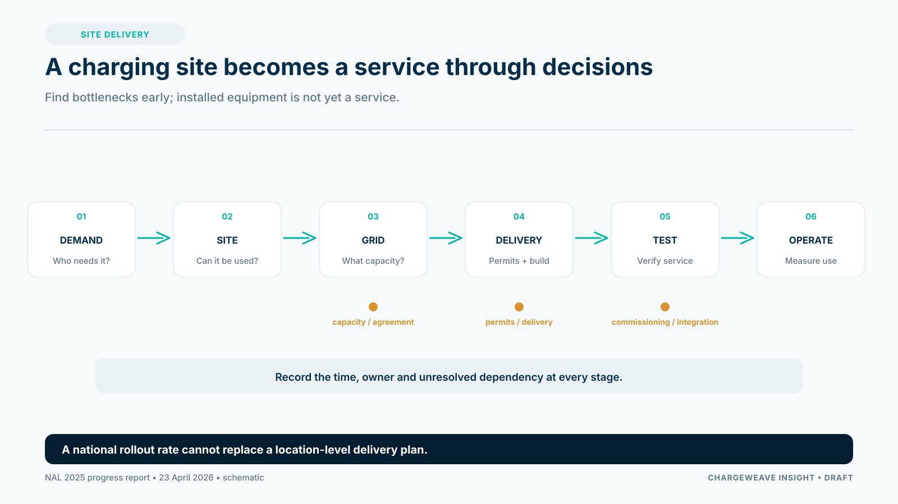

The Dutch charging network continued to expand in 2025, but the latest National Charging Infrastructure Agenda progress report makes a clear strategic point: deployment is moving from growth alone toward choices about where, how and under what constraints infrastructure can be delivered.

The NAL's 2025 progress report was published on 23 April 2026. Earlier public communication had reported an average addition of roughly 1,600 public charge points per month. That pace is a useful signal, but a national average does not tell a CPO how long a specific project will take or whether the new equipment will be used enough to support its costs.

## A charging point is not the same as a commissioned service

A successful project passes through multiple steps: demand assessment, site control, grid capacity, permits, equipment procurement, installation, software configuration, testing and customer launch. A delay in one step can leave capital committed but service unavailable.

CPOs should track the time and risk of each stage separately. Measure the time from initial site qualification to a connection application, from approval to installation, and from installation to a verified first session. Record the reason for each delay. That evidence helps distinguish a weak site from a permitting bottleneck, a grid constraint or an integration problem.

## Qualify the site before committing to scale

A site assessment should test more than projected vehicle numbers. It should include expected dwell time, access rights, nearby alternatives, utilization patterns, connection options, operating responsibilities and a realistic route to commissioning.

For multi-tenant or shared locations, identify who can approve the project, how users get access, how costs are allocated and who resolves disputes. For fleets, link charging demand to schedules and the operational cost of a missed departure. For public charging, assess visibility, availability and the user journey.

The right choice may be to defer, phase or redesign a project. A smaller initial installation can preserve an expansion path while limiting early exposure, provided that electrical design and commercial agreements support the staged approach.

## Use software to expose dependencies early

A CPO platform can help teams see which site facts, approvals, assets and partner connections are still missing. If the site configuration, tariff approval and commissioning test are connected in one workflow, an operator can find a readiness gap before the launch date.

ChargeWeave's proposed approach is to create a shared representation of those business objects and decisions. A simulation could allow the team to exercise the launch process using synthetic sessions before all equipment is live. The product value would need to be demonstrated in practice through fewer late discoveries, less rework or shorter time to verified service.

The rollout data says the market is expanding. For each CPO, the more useful question is whether its own delivery process turns selected locations into dependable, used and commercially sustainable charging services.

## Sources

- Nationale Agenda Laadinfrastructuur, “Voortgangsrapportage 2025: van groei naar keuzes in laadinfrastructuur,” 23 April 2026: https://www.agendalaadinfrastructuur.nl/nieuws/3256468.aspx?t=NAL-Voortgangsrapportage-2025-van-groei-naar-keuzes-in-laadinfrastructuur
- Government of the Netherlands, 2025 update on public charge-point rollout, 26 August 2025: https://www.rijksoverheid.nl/actueel/nieuws/2025/08/26/nederland-breidt-laadinfrastructuur-snel-uit-met-1.600-nieuwe-laadpunten-per-maand
