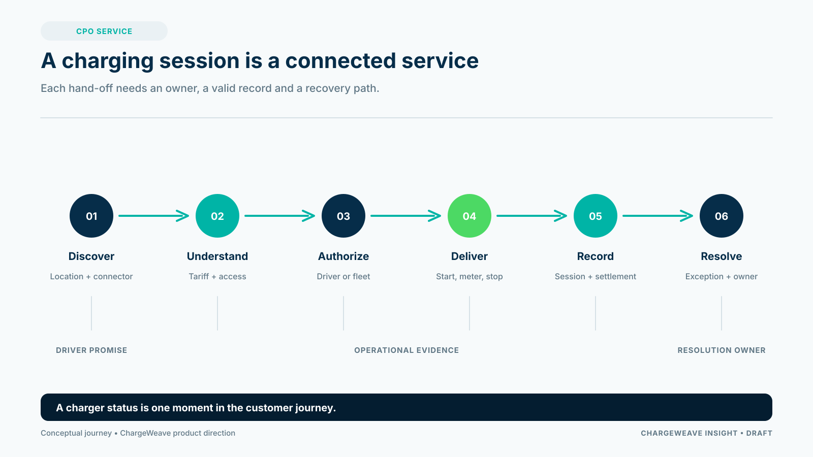

A charge point operator does not sell a charger. It promises a driver, fleet or site owner that charging will work when needed, at a price they can understand, with the energy and operational records available afterwards. The charging management platform is the system that helps make that promise repeatable.

That distinction matters. A screen that shows whether a connector is online is useful, but it is only one view of a longer service. A customer may need to find a location, understand the tariff, authenticate, start a session, receive energy, end the session, pay or be billed, and get help if something goes wrong. The CPO must connect those steps across hardware, software, energy and commercial partners.

## Start with the service, then select the platform

Before comparing software, describe the service the CPO wants to provide. Who is the customer? Which assets and locations are included? What does a successful charging session mean? Which party sets the tariff, handles payment, resolves a roaming dispute and is accountable for a failed start?

These questions reveal whether a platform is a fit. A useful assessment covers at least:

- operational control of sites, charge points and connectors;
- customer and driver access, including roaming where needed;
- tariff configuration and the complete record of a charging session;
- monitoring, alerting and a practical exception-handling process;
- integrations with energy, payment, fleet and partner systems;
- reporting that connects service quality to operating cost and revenue.

The right answer depends on the CPO's role. A public network operator, a fleet depot and a property manager do not have the same service promise. Buying the broadest feature list can add complexity without solving the highest-value operating problem.

## Ask how the platform handles the difficult cases

Demonstrations tend to show the happy path. A stronger procurement exercise asks what happens when the charger is online but a session will not start, a meter value arrives late, an approved tariff is missing, a roaming record is duplicated, or the connection to a partner is unavailable.

Ask the supplier to show how the issue is detected, who owns the next action, what evidence is retained and how the CPO can explain the final outcome. Check whether the same business terms mean the same thing in different modules. If a “completed session” has one meaning in operations and another in billing, reconciliation becomes a manual activity.

## Make interoperability and change part of the decision

Standards and interfaces can reduce the cost of connecting equipment and partners, but a protocol label alone does not prove that a real combination works. Test the actual charger, firmware, platform, roaming partner and payment route that matter to the service. Include retries, timeouts, corrections and upgrades.

A modern platform should also make change manageable. Can the CPO add a partner without rebuilding the customer journey? Can a site configuration be changed with an audit trail? Can records be exported if the operating model changes? Can teams test an integration before production credentials and hardware are available?

## Where ChargeWeave fits

ChargeWeave's product direction starts with a shared description of the CPO business: the actors, sites, assets, sessions, tariffs, obligations, workflows and evidence that connect the service. The aim is to help product, operations and engineering teams agree on what the platform must do before multiplying integrations.

That is a product direction, not a claim that every capability is already available. The practical test is whether a CPO can use the model to make one journey clearer, testable and easier to change.

A platform is ready for serious evaluation when it can demonstrate the complete service, including its exceptions, and show how the operator will know whether it is working.

## Sources

- European Union, Alternative Fuels Infrastructure Regulation, Regulation (EU) 2023/1804: https://eur-lex.europa.eu/eli/reg/2023/1804/oj
- Open Charge Alliance, OCPP overview: https://openchargealliance.org/protocols/open-charge-point-protocol/
- EVRoaming Foundation, OCPI: https://evroaming.org/ocpi/
