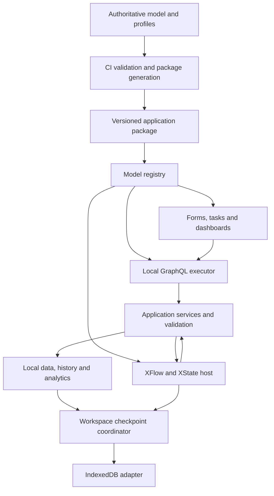

# Client-first ontology runtime: architecture and build plan

**Status:** Planned; this document does not implement the refactor.

**Decision date:** 2026-10-09.

**Inspected baseline:** [`5781c0beff9f7a8932881883ff0daddbd1fb666d`](https://github.com/pli-poc/charge-weave/tree/5781c0beff9f7a8932881883ff0daddbd1fb666d).

**Canonical repository:** `pli-poc/charge-weave`.

**Scope:** Browser application, generated contracts, local execution, persistence and GitHub verification. Syntriq integration is a later project.

## 1. Outcome and agreed decisions

Build and experiment with a small, fully local ChargeWeave application using the existing ontology, XFlow, temporal and analytical contracts. Generate its GraphQL interface and frontend metadata from authoritative model inputs. Reuse existing browser providers and XState logic. Establish a versioned, executable client contract that a future Syntriq backend can implement.

The developer must be able to load fixtures, query records, complete a model-driven task, advance a workflow, inspect history and analytics, save, reload and resume without a backend. A static development/Pages host serves assets; it is not a business API. A fresh offline installation/service worker is not a requirement of this phase.

| ID | Decision to preserve in later sessions |
|---|---|
| D01 | Client first. Do not modify Syntriq, deploy a server, introduce a database service, or require live accounts for this refactor. |
| D02 | Preserve RDF/OWL, SHACL, ontology identities and their existing generators. Do not replace them with a private GraphQL-only semantic model. |
| D03 | Preserve XFlow as the editable workflow contract and XState v5 as its execution runtime. BPMN is not required. |
| D04 | Generate GraphQL SDL, semantic metadata and resolver-binding descriptors. SDL is a derived artifact, never a separately maintained model. |
| D05 | The UI can execute standard GraphQL documents locally against browser providers. Neither HTTP nor an embedded database is required for local execution. |
| D06 | Workflow actions and GraphQL mutations share application services. XFlow runs against ontology-aligned application contracts, not SDL or arbitrary resolver calls. |
| D07 | Reuse the working provider, analytics, temporal fixture, form-renderer and flow-compiler boundaries. Extract incrementally; avoid parallel replacement engines. |
| D08 | Browser capabilities are an explicit supported subset. Unsupported constraints, inference, queries or flow steps must never silently count as successful execution. |
| D09 | Model, API mapping, workflow, calculation and persistence versions are explicit. Stored instances are never silently reinterpreted using the latest package. |
| D10 | Reusable JavaScript is independent of DOM, browser storage and Node-specific services. Environment capabilities are injected. |
| D11 | Small representative fixtures prove behavior. Large datasets, distributed execution, performance parity and production durability are separate future concerns. |
| D12 | Preserve the console's accessible, responsive presentation, existing demos, public deployment boundary and semantic verification gates. |

This plan refines the client implementation sequence under the [runtime HLD](runtime-architecture.md). It does not supersede the [temporal contract](temporal-contract.md), [analytical contract](analytics-contract.md), [XFlow contract](xflow-workflow-model.md), [task-form contract](task-form-engine.md) or independent business audit. The [semantic modeler roadmap](semantic-modeler-roadmap.md) remains a separate consumer of the same model package; building a new diagram editor is not a prerequisite.

## 2. What exists and what must change

The baseline below is source inspection, not a claim that fresh CI or production acceptance has passed.

| Existing file/boundary | Observed behavior | Refactoring treatment |
|---|---|---|
| `model/domain.schema`, `tools/build_all.py`, `tools/build_rules.py` and policy/profile inputs | Authoritative source pipeline produces ontology, shapes, rules and catalogues | Extend this ownership chain; never hand-edit a generated OWL/SHACL file or SDL |
| `website/scripts/build-model.mjs` | Produces hashed model/graph assets and manifest from generated semantic artifacts; checks catalogue/shape alignment | Extend to an application package through a shared compiler; include workflow, API, analytics and presentation inputs in package identity |
| `website/src/model/provider.js`, `model-utils.js` | Loads coherent static assets and checks hashes/revisions; Node tooling uses a generated snapshot | Reuse provider contract; add application-package validation and resolution of pinned versions |
| `console-app/src/provider.js` | `createPlatformProvider()` returns synthetic reads and `queryAnalytics(query)` | Retain as UI migration facade; place generated GraphQL execution behind it gradually |
| `console-app/src/analytics/engine.js`, `fixture.js` | Approved flat-projection adapter over a synthetic year, including delayed corrections and explicit query restrictions | Reuse semantics and tests; inject profiles instead of hard-wiring repository imports in reusable core |
| `model/analytics-profile.json`, `analytics-rules.json` | Own analytical measures, dimensions, allowed intent and pane configuration | Generate typed analytical API and metadata from these sources |
| `console-app/src/task-form-renderer.js`, `work-model.js` | Reusable form renderer, but sample task descriptors, case data and rating behavior are hand-authored JavaScript | Separate presentation profile, fixture values, command behavior and generated task descriptors |
| `console-app/src/app.js` | Contains direct demo state changes, work-item progression and site-to-revenue handlers | Route migrated interactions through application services; remove duplicate business decisions from those handlers |
| `website/src/simulation/flow-engine.js` | Validates an allowlisted definition subset; compiles XFlow to XState; accepts `snapshot` and `clock` | Extract without changing supported semantics; retain compatibility re-exports during migration |
| `website/src/simulation/correction-workflow.js`, `xflow/charge-correction.profile.json` | Normalizes a JSON-LD profile and binds activities/guards/actions/delays | Split reusable compiler from domain-specific registry; make dependencies injectable |
| `website/src/simulation/flow-engine.test.js` | Already tests snapshot restoration and host-delivered named deadline events | Preserve and extend; state persistence support does exist, but saving to durable browser storage is additional work |
| `tools/temporal_store.py`, `website/src/temporal-utils.js`, temporal fixtures | Python reference writer/SPARQL acceptance and JavaScript selection comparisons | Treat reference outputs as semantic oracle; do not claim that the full writer already runs in JavaScript |
| Existing local-storage preferences | Pane/theme/UI preferences can survive reload | Keep separate from coordinated business/process checkpoints |
| `.github/workflows/ontology-ci.yml`, `website-pages.yml` | Semantic verification; two application builds; production protection; browser tests; generated deployment to `pli-poc/charge-weave-app` | Extend existing gates and path coverage. Do not edit the generated public repository as source |

Specific gaps to track:

- The console does not currently depend on GraphQL or XState; the website owns the XState dependency. Avoid introducing duplicate, inconsistent runtime versions when sharing code.
- The model builder's `sourceHash` currently hashes `model/domain.schema`; the package content hash covers the current package payload. A new application digest must cover all contributing inputs and compiler versions, not just the domain schema.
- The builder removes old package directories. That behavior cannot support old persisted workflow versions without an explicit retention/cache strategy.
- Some form `concept` strings are illustrative paths, not proven canonical property mappings. For example, `ChargingSession.meterEndReading` and `RecordCorrection.*` in `work-model.js` need resolution or an explicit command-input binding. Do not silently create ontology terms to make these strings pass.
- Current numerical demo code uses JavaScript `Number` and rounding helpers. Introducing a `Decimal` GraphQL scalar alone does not make those calculations decimal-exact.
- Current browser analytics and temporal views represent different scoped fixture populations. A task correction must not appear to update an unrelated analytical dataset unless a declared projection mapping actually connects them.

## 3. Target layers and dependency rules



| Layer | Responsibility and prohibited coupling |
|---|---|
| Model registry | Resolve semantic IDs, classes, shapes/rules, scalar and capability metadata. Holds definitions, not mutable business records. |
| UI | Render descriptors, manage draft edits and submit operations. Must not decide accepted business outcomes or directly mutate shared records. |
| GraphQL | Parse, validate, coerce and execute generated operations. Resolve through services. A second, GraphQL-only rules implementation is prohibited. |
| Services | Own local command validation, references, revisions, idempotency, simulated access checks and accepted effects. Trigger or correlate workflow events through explicit ports. |
| XFlow host | Own actor lifecycle, task projection, event routing and named deadlines. Context contains references and small typed values, not whole duplicated record graphs. |
| Data/temporal/analytical providers | Evaluate the declared subset against local records and history. Preserve analytical population and time semantics. No DOM dependencies. |
| Checkpoint coordinator | Capture a coherent workspace revision spanning data, processes, event position and pending simulated work. No uncoordinated autosaving of actor and records. |
| Browser adapters | Implement static-asset loading, IndexedDB, clock, identifiers and simulated services. The core must not import these globals directly. |

The UI invokes task commands through GraphQL once migrated. The XFlow host invokes the same application services directly; it does not construct GraphQL strings internally. Services and workflow dispatch communicate through injected ports to avoid circular module imports and re-entrant mutation loops. All accepted local writes enter one serialized workspace command queue.

## 4. Source ownership, generation and package contract

### 4.1 Preserve one source of truth

Use the sources identified in [development.md](development.md), especially the domain DSL, rule generators, policy JSON, analytical profile and XFlow JSON-LD. OWL/SHACL remain the semantic contract and verification target, but their generated files do not become a new editing surface.

Add small declarative inputs for decisions that cannot be inferred safely:

| Proposed input | Editable purpose |
|---|---|
| `model/client-api-profile.json` | Exposed concepts, operation names, approved relation paths, query limits, scalar policies and service-binding keys |
| `model/client-task-profile.json` | Task inputs/outcomes, canonical property or command-input bindings, groups, labels and control hints |
| `model/client-capabilities.json` | Supported rule IDs/constructs, queries, inference policy, temporal subset and workflow steps |
| `model/client-command-profile.json` | Command input/output contracts, revision checks, idempotency scope, required rules and allowlisted handler IDs |

These profiles reference existing semantics. They may define application-specific command payload fields, but must identify them as such. They must not copy and weaken the ontology's datatype, unit, cardinality or business rules. Presentation-only fields are not new domain facts.

Generation should resolve through one normalized intermediate model, then emit:

- `schema.graphql`: generated standard GraphQL SDL.
- `api-bindings.json`: type/field/operation-to-semantic-ID and service-operation mappings.
- `runtime-model.json`: supported constraints, canonical identities, datatypes, vocabularies, lineage and relationship metadata.
- `flows.json`: validated, normalized XFlow definitions and registry references.
- `task-descriptors.json` and `analytics-descriptors.json`: model-linked frontend metadata.
- `capabilities.json`: executable support and explicit limitations by operation/rule.
- `manifest.json`: package ID, model version, contract version, generator version, artifact hashes and semantic-input digest.

Resolver **bindings** are generated; implementations of named domain commands and complex rule evaluators remain reviewed JavaScript. Do not claim to generate correct arbitrary business behavior from OWL or formula strings.

XState machines are compiled from the pinned normalized definitions by the existing compiler at runtime. CI validates and exercises that compilation. Do not serialize a live machine object, JavaScript closures or running actors into the application package.

### 4.2 Artifact and version policy

Generated client artifacts belong in ignored build output and immutable published package directories. Do not require hand-maintained or independently edited SDL in Git. Keep compatibility expectations and approved public schema snapshots only as generator-produced review/test evidence, never as alternate input. Extend the current drift tooling explicitly; `tools/check_generated.py` does not currently cover a new JavaScript application package automatically.

Generate twice from the same inputs and compare normalized artifact bytes/hashes. Stable sort rules, term mappings and serialization are part of the compiler contract. Exclude wall-clock build timestamps and machine-specific paths from semantic digests. Keep build provenance separately; it may record the commit, tool versions and execution time.

Pin together: model version, model/shape/rule digests, API profile/contract version, flow definition ID/version/digest, application package digest, calculation version and exact dependency lock. Browser snapshots additionally pin storage format and XState runtime compatibility. Do not fabricate equivalence between the JavaScript fixture fingerprint and the existing Python RDF canonical digest.

## 5. GraphQL projection and semantic fidelity

Use a pinned, tested GraphQL.js release to execute locally. Keep standard GraphQL grammar; no bespoke parser or server framework is necessary. The executor should parse, validate and apply budget checks before executing. Use an asynchronous interface from the beginning even when providers currently return synchronously.

The following are proposed service boundaries, not existing exports:

```js
const client = createLocalClient({ applicationPackage, workspace, services });
const result = await client.execute({
  operationName: "ReviewTask",
  query: document,
  variables: { id: taskId },
});
```

Operation context (workspace, selected package, simulated principal, clock and cancellation) is supplied by the host. User-provided variables cannot override host identity or declare their own validation success.

### Projection rules

| Semantic concern | Contract to implement and test |
|---|---|
| Identity | Stable IRI references and a reversible, collision-checked mapping to legal GraphQL names. Preserve development IRIs. GraphQL names are not new semantic identities. |
| Class inheritance | Declare the supported class/interface projection. Multiple typing/inheritance must be mapped deliberately or reported as unsupported; do not equate GraphQL interfaces with all OWL semantics. |
| Required values | Derive executable constraints from shapes and the selected operation profile. OWL restrictions alone do not establish closed-world record completeness. |
| Lists | Preserve cardinality separately. A non-null GraphQL list may be empty; `minCount >= 1` still requires validation. RDF sets have no intrinsic order, so specify deterministic output ordering. |
| Missing information | Specify omitted, explicit null, unknown, unavailable and false separately. Metadata/results must carry knowledge/result state where the distinction matters. |
| Decimal, integer and time values | Decimal quantities/money use canonical decimal strings and defined precision/rounding. Avoid GraphQL `Float` for exact values. Preserve large integers without 32-bit `Int` truncation; distinguish Date, Time and timestamp scalars. |
| Languages and controlled values | Preserve language-tagged values and canonical vocabulary identities. Generate enums only for declared closed vocabularies with explicit version handling. |
| Relationships | Allow named, bounded paths with reference resolution. Define inverse lookup and temporal assignment; no silent fan-out that duplicates analytical facts. |
| Constraints | Publish applicability, source rule/shape ID and runtime support. Unsupported mutation-critical rules block that operation; they are not treated as passes. |
| Reasoning | Initial runtime profile is asserted facts plus explicitly declared compiled schema closure. No full runtime OWL reasoner is promised. Requests for unsupported inference fail explicitly. |
| Ordinary clients | Expose typed business fields and commands. A client must not need RDF triples or ontology tools just to query a record. |
| Generic frontend | Provide generated metadata queries for semantic identities, constraints, units, task descriptors, analytical policies and capabilities. Standard schema introspection alone is insufficient. |

Start filtering with the operations the selected providers actually implement. Preserve the analytics contract's `Equal`/`In` and pre-/post-aggregation stages; add other entity operators only with explicit semantics and fixtures. Specify null comparison, string case/collation, stable ordering and bounded pagination. Do not imply that all possible GraphQL queries, joins or SPARQL operations are executable.

Commands such as task submission require an expected revision and idempotency key. Avoid universal CRUD for issued/immutable records. GraphQL mutations being executed serially does not make a multi-field request atomic: the first profile permits one top-level business mutation per request, with an explicit service-level commit boundary.

Use normal GraphQL `data`/`errors` behavior for parsing, typing and resolver failures. Standardize `errors[].extensions.code`, relevant semantic/rule IDs and version information. Model expected task/domain rejection as typed command results with field violations; unexpected execution errors must not look like successful outcomes. Freeze this distinction in fixtures. Partial query results must retain errors; partial business writes must not be silently accepted.

## 6. Shared services, XFlow and task execution

Extract the reusable `flow-engine.js` and its supporting helpers behind an import-compatible module. Keep the current five step kinds, JSON-only definitions, explicit error branches and own-property allowlisted registry validation. Do not add arbitrary executable expressions, parallel/join, compensation or new flow grammar as part of extraction.

Create a local application-service registry for queries, commands and rule evaluators. Domain bindings remain ChargeWeave-specific; the registry/execution machinery is generic. All dependencies are supplied through ports, including clock, ID generation, reads, writes, evidence resolution and simulated activity execution.

For a migrated human task:

1. Load its pinned package and XFlow definition.
2. Project the current `HumanTask` into a business-facing work item and generated descriptor.
3. Render only the task-scoped editable fields and allowed outcomes.
4. Submit the typed command through local GraphQL.
5. Recheck task/record revisions, task scope, allowed outcome, references and supported rules in the service layer.
6. Commit accepted simulated effects and correlated events through the workspace coordinator.
7. Deliver the committed event to the actor once; project the resulting task/progress state.

The exact task-to-event mapping must be inspected. The console's corrected-reading form and the developer flow's approval wait are related demonstrations, but not automatically the same event contract. Introduce explicit payload mapping; do not simply rename a UI submit action to an approval event or bypass the existing evidence/decision steps.

Keep draft form values in UI state until accepted. Keep business records outside actor context. Permit read-only context and small calculation previews through services, but final outcomes must use the same reviewed calculation and validation code.

## 7. Browser persistence and restart behavior

Use an in-memory workspace for active execution and one IndexedDB database per application origin, with isolated workspace IDs and revisions. Keep theme/pane preferences separate. Persistence is a browser convenience with tested semantics, not a claim of server durability, trustworthy authorization or synchronization.

An initial checkpoint envelope should include:

- Storage format, workspace ID/revision and application-package digest.
- Business record revision set, temporal head and fixture/source version.
- Pinned flow identities, supported XState persisted snapshots and projected tasks.
- Accepted input/event sequence position, pending simulated effects and their idempotency records.
- Named deadlines with due instants or virtual-clock coordinates, fired/cancelled state and correlation IDs.
- Clock mode/current virtual time, PRNG state where used, and actor-compatible runtime version.

Use `getPersistedSnapshot()` and the existing `snapshot` restore option. Do not persist `getSnapshot()` as an interchangeable format. No DOM nodes, functions, database handles or live promises belong in snapshots. Snapshot support is already present in XState; the new work is storage and coherent recovery around it.

### Coherent save strategy

First milestone: explicit save/resume at verified stable wait/end boundaries, after simulated effects settle and event queues drain. Stage a complete, immutable checkpoint before opening the IndexedDB transaction; write it and update the workspace head atomically. Do not hold an IndexedDB transaction open across arbitrary asynchronous workflow work.

The UI must report unsaved versus saved state accurately. If saving fails, retain the last valid checkpoint and keep the new state visibly unsaved. Refresh resumes the last committed checkpoint; do not pretend every intermediate in-memory transition was durable.

Next milestone: if continuous autosave is required, implement journaled accepted events/effect intents and revision-based checkpoint progression before claiming mid-activity recovery. Invoked activities may restart on restoration; simulated effects must have deterministic idempotency keys and persisted outcomes. Do not assume an actor snapshot alone guarantees exactly-once side effects.

Use a local single-writer policy. Serialize commands in a tab and compare the expected workspace revision within the IndexedDB write transaction across tabs. Stale tabs must reload or become read-only rather than overwrite newer state. No merge/synchronization protocol is required.

### Restore strategy

1. Load a complete committed checkpoint and verify storage format, hashes and package/flow versions.
2. Resolve the exact pinned package from the release assets or verified local cache. If unavailable, offer export/reset or a reviewed migration; never use the latest package silently.
3. Reconstruct local records, services, clock and registries before starting actors.
4. Restore actors and tasks; reconcile pending effects/deadlines under the declared supported policy.
5. Test historical reads and business/process consistency before presenting a resumed workspace as saved.

Virtual time should remain explicit and reproducible. If real-time deadlines are enabled, restore original due times rather than restarting the full delay. The browser cannot guarantee timers execute while closed or suspended; overdue events are reconciled on resume. Test that each due event is delivered at most once within the supported local journal policy.

Handle quota denial, missing storage, incompatible packages, damaged checkpoints and multi-tab conflicts explicitly. Memory-only mode is an allowed fallback with a visible persistence status. Reset must delete only the selected workspace and its associated records; it must not wipe unrelated preferences or other applications on the same Pages origin.

## 8. Temporal and analytical preservation

Maintain separate meanings for reporting interval, business-valid selection, recording/knowledge cutoff and forecast target time. Never collapse them into one timestamp.

- Reuse the committed Python/SPARQL outputs and `website/src/temporal-utils.js` for the first read-only temporal profile.
- Select a coherent scoped snapshot for all participating relationship reads. Do not join historical facts to current attributes by default.
- Continue rejecting incomplete sources, invalid intervals, conflicting revisions and unsupported calendars rather than filling missing information with zeros.
- Keep issued evidence immutable. Corrections create linked revisions/compensating records under existing contracts.
- Introduce browser temporal writes only for a declared subset, with differential fixtures for correction, partial correction, retraction, interval edges and unchanged outside intervals. Read-only support does not establish writer equivalence.
- Wrap the existing analytics provider first. Retain ratio-of-sums, fact grain, currency/financial basis, before/after filters, stable ranking and selected revision evidence.
- Move decimal-sensitive calculations to a shared exact representation after a parity/rounding audit. Preserve intentional rounding stages and update golden expectations transparently if a defect is corrected.
- Return typed result state, unit, components, time context, source/profile/metric versions and completeness. JSON evidence is not automatically a fully populated RDF execution record or cryptographic receipt.
- Keep operational, financial and historical fixture populations separate unless a named projection binding joins them. Add a tiny linked correction dataset if the acceptance slice needs to demonstrate changed analytics after a task.

## 9. Proposed code organization

All paths below are proposed, not yet implemented. Prefer ordinary ES modules with JSDoc/runtime contracts; a whole-app TypeScript or UI-framework migration is out of scope.

| Proposed location | Contents |
|---|---|
| `client-runtime/package.json` | Shared private package, locked GraphQL/XState dependencies and test/build scripts |
| `client-runtime/src/model/` | Model registry, semantic ID resolution, capability checks |
| `client-runtime/src/graphql/` | Schema assembly, scalar handling, generated binding dispatcher, operation execution/error mapping |
| `client-runtime/src/services/` | Service interfaces, command orchestration, validation and revision/idempotency contracts |
| `client-runtime/src/flow/` | Extracted XFlow compiler and host; registered domain code remains separate |
| `client-runtime/src/providers/` | In-memory records, bounded temporal selection and analytical adapters |
| `client-runtime/src/ports/` | Clock, storage, identifier, activity and package-loading contracts |
| `client-runtime/src/adapters/browser/` | Static package loader, IndexedDB and browser lifecycle handling |
| `client-runtime/src/profiles/chargeweave/` | ChargeWeave bindings and simulated domain activities; no generic core dependence on these |
| `client-runtime/scripts/` | Application package compiler and deterministic-generation checks |
| `client-runtime/tests/`, `tests/client-contract/` | Unit/contract scenarios and versioned input/result fixtures |
| `client-runtime/generated/` | Ignored generated SDL/descriptors used by both builds |

Keep migration re-exports in existing module locations until both console and website consumers are moved. Use local package imports and a lockfile strategy validated by `npm ci` in CI; do not restructure every repository dependency merely to introduce the shared package. The package builder must run before either consumer builds. Static model loading must work under the existing Pages base paths, including `/app/`.

## 10. Build sequence and reviewable milestones

All items are unchecked because this commit only adds the plan. Complete each phase with code, meaningful evidence, documentation and a commit; record its SHA and known limits in the progress ledger. Dependencies are explicit so a later session can resume without guessing.

### P0 — Baseline and executable contract inventory

**Depends on:** none. **Primary paths:** current providers, form/flow/profile files and existing test suites.

- [ ] Inventory each UI read/write and name its current provider or direct-state handler.
- [ ] Inventory supported flow steps/events, analytical operators, temporal reads, fixture populations and constraints.
- [ ] Capture existing positive, rejection, correction and restoration outputs as small versioned contract scenarios; record the baseline commit and package/dependency versions.
- [ ] Resolve the initial task/profile bindings against actual ontology terms and command inputs.
- [ ] Record the supported browser profile and mutation prerequisites; exclude operations whose required rules cannot be evaluated locally.

**Exit:** a checked-in inventory and reusable fixtures describe current behavior without claiming full GraphQL, OWL inference, SHACL or durable browser execution. Existing tests remain green.

### P1 — Shared module extraction and injected environment

**Depends on:** P0. **Primary paths:** `flow-engine.js`, simulation helpers, analytics engine, new `client-runtime/` package.

- [ ] Extract the generic compiler/registry and deterministic helpers, retaining existing imports through re-exports.
- [ ] Separate ChargeWeave activities, profiles and fixture generation from generic core logic.
- [ ] Inject clock, IDs, profile data, records and activities. Move browser globals to adapters.
- [ ] Share one compatible locked XState v5 version between console and website; preserve current compiler semantics.
- [ ] Check direct provider results and existing flow tests before and after extraction.

**Exit:** shared core tests execute in Node without a DOM or production network; browser demos still work; no second analytics or workflow implementation is introduced.

### P2 — Deterministic application-package generator

**Depends on:** P0, P1. **Primary paths:** existing model builder, new declarative profiles and shared compiler.

- [ ] Add validated API/command/task/capability profiles and normalized intermediate model.
- [ ] Generate SDL, binding descriptors, runtime metadata, normalized flows and task/analytics descriptors.
- [ ] Include all semantic inputs, compiler version and dependency provenance in a coherent manifest.
- [ ] Add name-collision, unresolved-IRI, missing-rule, weakened-constraint and unsupported-required-feature failures.
- [ ] Decide package cache/retention behavior before removing old generated assets.
- [ ] Add a clean regeneration/diff gate; build output is never a handwritten source.

**Exit:** two clean builds agree; changing one authoritative field changes its API/metadata projections consistently; intentional semantic drift fails CI.

### P3 — Local GraphQL reads, metadata and validation

**Depends on:** P2. **Primary paths:** generated bindings, local executor, model registry, `console-app/src/provider.js`.

- [ ] Assemble an executable GraphQL schema from generated artifacts and allowlisted bindings.
- [ ] Implement `execute({ query, variables, operationName })` with asynchronous results, validation and bounded execution.
- [ ] Expose model/task/analytics metadata and capability discovery; do not rely on custom-directive introspection alone.
- [ ] Map an approved site/session read and supported filters to existing local providers.
- [ ] Implement and verify decimal/IRI/date/time/large-integer serialization plus missing-value semantics.
- [ ] Run query fixtures through both direct provider and GraphQL paths with equivalent semantics.

**Exit:** a conventional GraphQL client can read typed business data locally without OWL knowledge; a generic UI can discover semantic metadata. No backend requests occur.

### P4 — Shared commands and generated task forms

**Depends on:** P3. **Primary paths:** task renderer, `work-model.js`, selected `app.js` handlers, service registry.

- [ ] Move task presentation and command-field bindings into declarative source profiles; generate descriptors.
- [ ] Implement scoped task read/submission, expected revision, idempotency and typed rejection outcomes.
- [ ] Reuse supported structural constraints and reviewed business-rule evaluators with rule-level traceability.
- [ ] Move the selected calculation/accepted-state change out of the UI into shared services.
- [ ] Keep remaining unconverted screens operational and explicitly outside the migrated profile.

**Exit:** editing model/profile inputs changes the selected form without a form-specific view rewrite; invalid submissions leave records and process state unchanged; duplicate accepted commands do not duplicate effects.

### P5 — Connect the operator task to the existing XFlow host

**Depends on:** P4 and P1. **Primary paths:** correction profile/registry, flow host and Work inbox/case views.

- [ ] Define the explicit task-to-XFlow event mapping and preserve validation/approval decisions.
- [ ] Derive the active work item, outcomes, deadline and progress from the running instance.
- [ ] Replace the selected hand-maintained UI progression with host projections.
- [ ] Pin package/flow versions and use canonical references in context.
- [ ] Exercise success, missing evidence, rejection, timeout, duplicate input and final-state behavior.

**Exit:** the console and developer flow view show the same instance outcome for the same scenario; neither independently owns process progression. XFlow executes against the application model, not SDL.

### P6 — Temporal and analytical GraphQL parity

**Depends on:** P3; use P5 for the optional linked correction slice.

- [ ] Expose supported analytical inputs/results through generated typed operations and descriptors.
- [ ] Preserve the existing historical provider's semantics and evidence through the GraphQL layer.
- [ ] Expose the bounded `validAt`/`knownAt` selection profile with coherent relationship reads.
- [ ] Reuse Python/SPARQL and Node expected results as differential oracles.
- [ ] Complete the exact-number audit before declaring numeric parity; document any versioned correction.
- [ ] If browser history writes are included, implement only the declared subset and its rejection/immutability cases. Keep other temporal capabilities read-only or unavailable.

**Exit:** weighted measures, unavailable results, cutoff selection, ranking and correction evidence survive projection unchanged. Task writes affect only explicitly connected analytical populations.

### P7 — Coordinated IndexedDB save and resume

**Depends on:** P5 and P6. **Primary paths:** checkpoint coordinator, browser storage adapter and workflow host.

- [ ] Implement explicit stable-boundary checkpoints before attempting continuous autosave.
- [ ] Persist workspace data/history, task/actor state, clock/deadlines and version identity in one checkpoint transaction.
- [ ] Restore exact package/flow versions, including a verified pinned-package cache or retained release asset.
- [ ] Implement revision conflict handling across tabs, save failures and memory-only mode.
- [ ] Add scoped reset and checkpoint export/import for synthetic workspaces, with version/integrity validation.
- [ ] Add journal/effect-intent recovery only if mid-activity restart is in scope; otherwise reject saving during unsettled execution and state that limitation.

**Exit:** close/reload at supported checkpoints resumes coherent records and workflow state; overdue named deadlines follow the clock policy; incompatible or damaged snapshots never silently reset or reinterpret data.

### P8 — Consolidation, CI release gate and handoff

**Depends on:** P0–P7.

- [ ] Migrate the chosen end-to-end slice fully and remove its duplicate UI business logic; retain unrelated demos until separately migrated.
- [ ] Integrate generation, core, contract, browser and source-boundary checks into existing Actions.
- [ ] Test the assembled protected artifact, including local GraphQL execution and persistence; preserve public-source-link and obfuscation checks.
- [ ] Publish the application package, schema diff, capability inventory and fresh contract reports as commit-bound evidence.
- [ ] Update HLD, model-provider, task, flow, temporal, analytics and development docs to actual implemented status.
- [ ] Document a future remote-adapter contract from the passing client fixtures without modifying Syntriq.

**Exit:** the browser acceptance matrix passes in CI for the exact published artifact. Server compatibility is a target contract, not a claim that Syntriq already implements it.

## 11. First usable slice and acceptance matrix

The first usable slice ends after P5: load the generated package, query a case/task, render its generated form, submit a validated outcome and observe the XFlow transition locally. P6 adds typed analytical/temporal access; P7 makes supported checkpoints survive reload. Do not postpone the usable slice until all screens are refactored.

| ID | Scenario | Required observable result |
|---|---|---|
| A01 | Same sources built twice | Identical semantic artifacts/digests; provenance differences isolated |
| A02 | Field/shape/profile changes | SDL and metadata regenerate together; drift is rejected |
| A03 | Unknown IRI, collision or missing handler | Package publication/execution fails with an attributable error |
| A04 | Ordinary GraphQL query | Typed data returned without requiring ontology-aware client logic |
| A05 | Metadata-driven form | Correct task-scoped controls, units, constraints and field-level errors |
| A06 | Empty required list; omitted/null/false; decimal boundary | Explicit, consistent validation and serialization outcomes |
| A07 | Unsupported filter, inference or rule | Explicit unsupported capability result; no apparent pass |
| A08 | Task submission and duplicate retry | One accepted effect, one correlated transition and stable result |
| A09 | Stale task/record revision or invalid transition | No partial business/process change |
| A10 | Missing evidence, approval denial, timeout | Existing XFlow branches remain distinguishable and correctly projected |
| A11 | Original versus corrected knowledge cutoff | Expected original/corrected values and revision evidence |
| A12 | Historical relationships | All participating values selected from the same declared time context |
| A13 | Weighted availability | Ratio of sums; preserve the existing 10% versus incorrect 50% regression |
| A14 | Missing fact, zero baseline, mixed currencies | Unavailable/rejected according to existing analytical contract; never fabricated zero |
| A15 | Ranking and comparison | Stable ties, explicit population totals and correct baseline alignment |
| A16 | Stable checkpoint reload | Data, process state, task revision and clock resume coherently |
| A17 | Package upgrade with old workspace | Exact old version restored or explicit migration requirement |
| A18 | Save failure, damaged snapshot, stale second tab | Last valid checkpoint preserved; failure/conflict made visible |
| A19 | Refresh while simulated activity is pending | Declared checkpoint/retry policy; no invented exactly-once guarantee |
| A20 | No-backend browser run | First-party static assets allowed; no business API/production service calls required |
| A21 | Desktop/mobile and keyboard | Existing design and task/dashboard interactions remain usable |
| A22 | Protected deployment bundle | GraphQL names, model IDs and persisted JSON keys survive build/protection unchanged |

Add a small synthetic domain-neutral contract fixture (for example a document review) to exercise generator/service/flow mechanics without EV-specific branches in core code. Retain real ChargeWeave acceptance slices as domain evidence. Do not duplicate the entire ontology for this fixture.

## 12. CI and developer workflow

Current commands that remain relevant:

```bash
python tools/check_generated.py
python tools/test_xflow.py
python tools/test_temporal.py
python tools/test_analytics.py
npm ci --prefix console-app
npm ci --prefix website
npm test --prefix console-app
npm run build --prefix console-app
npm run build --prefix website
```

Full website/Playwright verification follows the existing assembled/protected-build workflow, not an unprepared isolated invocation. Keep all current ontology gates; a successful local GraphQL test is not a substitute for SHACL/business/temporal verification.

Proposed additions during P2–P8:

1. Install locked shared-runtime dependencies and generate the application package before either UI build.
2. Validate generated SDL and all semantic bindings; emit a schema compatibility diff and per-rule runtime support report.
3. Test core JavaScript without DOM/network and compare direct-service versus GraphQL results.
4. Run narrow differential fixtures against Python semantic/temporal references where equivalence is claimed. Unsupported rules remain explicitly unexecuted.
5. Run browser tests for task flow, analytics, save/reload, version mismatch and storage failure against the deployable artifact.
6. Include `client-runtime/**`, `tests/client-contract/**`, generator changes and any new lockfile in workflow triggers, install/build ordering and package evidence. Existing website path filters omit a new shared directory.
7. Ensure the public bundle exports only intended metadata and synthetic examples. Preserve the existing deployment to `charge-weave-app` and do not publish source maps, private traces or credentials.

Obfuscation is not secrecy. Generated GraphQL schemas and metadata delivered to clients are inspectable by design. Existing production protection must preserve contract names, public exports and serialization keys. If protection changes hashes of generated JS artifacts, distinguish semantic source hashes from deploy-byte integrity hashes and finalize deploy manifests after transformation.

Authoritative shared evidence is GitHub Actions for the exact commit. Pin new dependency versions after a compatibility check; do not upgrade XState major versions or add experimental persistence APIs as incidental work.

## 13. Risks and deliberate boundaries

| Risk | Required response |
|---|---|
| Treating SDL as the full ontology | Preserve source model and metadata; document mapping coverage; reject unsupported executable semantics |
| Browser validation presented as complete SHACL/authorization | Publish rule-level capability coverage and local-simulation status; mutation prerequisites must be satisfied |
| Rewriting current providers unnecessarily | Extract and wrap; compare against existing fixtures before replacing any behavior |
| Numeric changes hidden by scalar labels | Shared decimal implementation and explicit rounding tests; version altered calculations |
| Snapshot replays duplicate effects | Stable checkpoints first; journal/idempotency before mid-effect guarantees |
| Independent business and workflow saves | One workspace checkpoint/revision boundary and restore consistency checks |
| Old workflows use newly generated definitions | Pin and resolve exact package/flow versions; migrations are explicit |
| New module breaks public deployment | Extend path triggers, dependency installation, base-path handling and protected-artifact browser checks |
| Browser demo grows into a database/reasoner project | Keep bounded datasets, declared query/validation subset and no production-scale claims |

Deferred: Syntriq server implementation, C# engine changes, V8/Jint embedding, Node server hosting, WebAssembly, live OCPP/OCPI/payment calls, production identity, distributed scheduling, arbitrary SPARQL/OWL reasoning, cross-device sync and multi-user conflict resolution. Host-independent JavaScript preserves future options; it does not select or prove an embedding runtime now.

## 14. Progress ledger and next-session instruction

| Phase | Status at plan commit | Evidence/commit |
|---|---|---|
| P0 | Not started | Baseline source inspection only; see section 2 |
| P1 | Not started | — |
| P2 | Not started | — |
| P3 | Not started | — |
| P4 | Not started | — |
| P5 | Not started | — |
| P6 | Not started | — |
| P7 | Not started | — |
| P8 | Not started | — |

Use this request in a later session:

> In `pli-poc/charge-weave`, implement `docs/client-runtime-build-plan.md`. Read `AGENTS.md`, inspect the current HEAD and the progress ledger, then start with the first incomplete phase. Keep this client-only: preserve the ontology/SHACL and XFlow/XState, generate the GraphQL SDL and metadata, reuse local providers, and do not modify Syntriq or the generated public repository. Commit and push reviewable milestones, check the relevant GitHub Actions, and update the ledger with actual evidence and remaining limitations.

Start with P0 followed by P1–P3; do not delete working screens or replace the semantic foundation. If later source changes conflict with this baseline, record the difference and update the affected milestone before refactoring it. Never mark a phase complete merely because its design or types exist.

## 15. Reference implementation guidance

The repository contracts linked above are authoritative for ChargeWeave semantics. External library references clarify mechanisms, not product completeness:

- [GraphQL.js execution API](https://www.graphql-js.org/api-v16/execution/) — local execution does not require an HTTP server; parsing/validation and contract rules remain application responsibilities.
- [GraphQL schema/type documentation](https://graphql.org/learn/schema/) — use standard schemas and explicit projections.
- [XState persistence](https://stately.ai/docs/persistence) — persisted actor snapshots and restore; verify against the exact v5 dependency locked in this repository.
- [XState actions](https://stately.ai/docs/actions) — action execution is not an awaited storage transaction; the host must own checkpoint/side-effect coordination.

This document adds an implementation plan only. It neither changes runtime behavior nor establishes server/browser parity before those implementations and tests exist.
