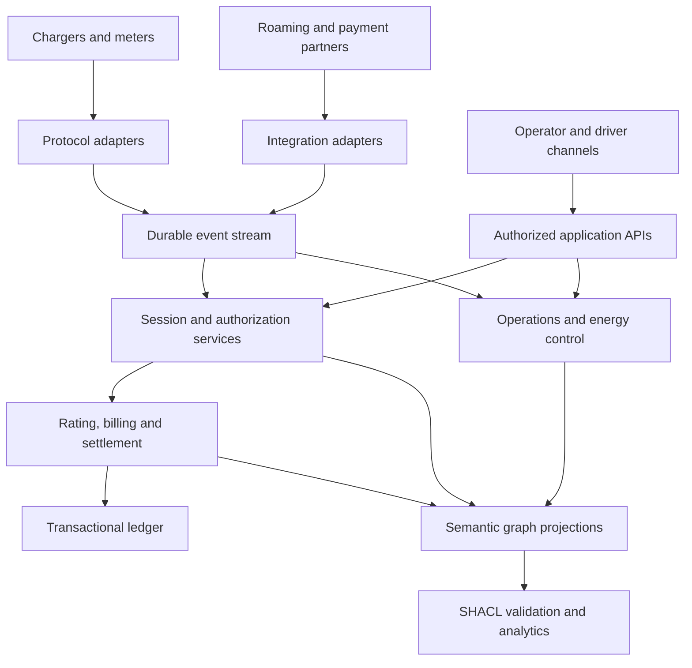

# From ontology to an executable CPMS

Use the ontology as the shared meaning and validation contract across services. Do not require the real-time charger path to wait for global OWL classification or a whole-tenant SPARQL scan.

## Service contracts

| Service | Writes | Essential behavior |
|---|---|---|
| Device gateway | SourceEvent, ProtocolTransaction, CommandOutcome, observations | Device identity, versioned protocol parsing, correlation, deduplication, offline replay |
| Asset registry | Sites, stations, units, connectors, topology and capabilities | Commissioning, ownership, configuration versioning and compatibility |
| Authorization | Requests, decisions, credentials, reservations | Explicit policy evaluation, local/offline decisions, bounded validity and audit |
| Session orchestrator | Sessions, intervals, event chronology, finalization evidence | Idempotent lifecycle transitions and reconciliation of incomplete sessions |
| Pricing/rating | Resolved tariff versions, rated lines and calculations | Deterministic replay, currency precision, pricing precedence, tiers and tax evidence |
| Payments | Intents, holds, captures, refunds, disputes | Provider idempotency, confirmed outcomes, retry reconciliation and tokenized instruments |
| Ledger/settlement | Journals, partner allocations, payouts and reports | Balanced postings, immutable history, corrections and financial reconciliation |
| Roaming | Module agreements, exchanges, publication and external CDRs | Contract negotiation, sync cursors, bounded retries and command-result correlation |
| Energy control | Constraints, schedules, applications and flexibility delivery | Physical safety envelopes, phase awareness, stale-data fallback and local limits |
| Operations | Issues, recovery attempts, work orders, uptime results | Alert policy, safe recovery, maintenance evidence and reproducible availability calculations |
| Customer/business services | Accounts, subscriptions, benefits, agreements and reimbursements | Historical policy selection, bounded entitlements and audited cost allocation |
| Platform services | Principals, access grants, integrations, events and consent | Tenant isolation, authorization on every write, secret management and delivery auditing |

## Storage choices and transaction boundaries

Keep immutable protocol/event envelopes and evidence artifacts in durable stores. Store financial journals and concurrent mutable write models in systems with appropriate transactional guarantees. Retain high-rate measurements in time-series storage when warranted; the graph can describe observation batches and retained evidence without duplicating every telemetry point.

Project canonical RDF records into tenant-scoped graphs for validation, knowledge queries and integration. The projection should include a watermark and source revisions so consumers can distinguish a complete snapshot from an in-flight update. Run local shape checks before accepting writes, and run affected-neighborhood business checks with the required reference closure. Batch full-tenant audits at explicit projection watermarks.

Grant access at the API and data-store boundaries. A `tenant` triple records ownership; it is not an authorization mechanism. Store references to secrets in the graph, with actual credentials controlled by a secret manager. Never place card numbers, bearer tokens or private keys in canonical identifiers or public RDF documents.

## Protocol mapping policy

Pin version-specific adapters. OCPP 1.6 and OCPP 2.0.1 are different wire contracts; OCPP 2.1 adds additional capabilities. Keep source connector/EVSE addressing and boot-scoped transaction identifiers in the adapter and external identifiers. Map them to canonical station/unit/connector identities without assuming an OCPP 1.6 connector ID is a globally unique EVSE identity. [OCA protocol overview](https://openchargealliance.org/protocols/open-charge-point-protocol/)

The EVRoaming Foundation identifies OCPI 2.3.0 as the current published version and includes optional booking and payment-terminal modules. Negotiate modules explicitly; an active connection does not imply support for every module. The model does not claim implementation or certification of OCPI, OICP, ISO 15118 or OpenADR. [OCPI overview](https://evroaming.org/ocpi/)

## Recovery sequence

For a missing stop event, retain the source gap, obtain subsequent meter or partner evidence, create reconciliation records, and finalize with an explicit basis and completeness classification. Do not invent device confirmation. Rating and settlement should reference the finalized evidence version, and later corrections should create a correction lineage with compensating financial records.

For a payment timeout, query or reconcile provider state using the original idempotency key before retrying collection. For a remote-command timeout, distinguish unknown physical outcome from an explicit rejection. For a stale energy meter, apply a defined local/edge fallback; a cloud schedule cannot guarantee electrical safety during loss of communication.
