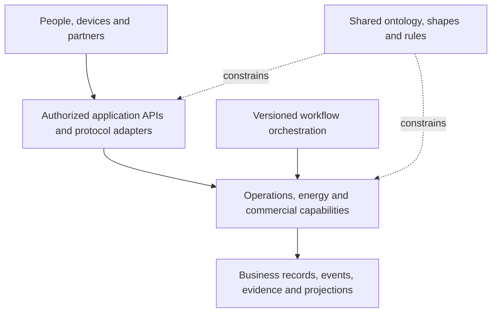

# ChargeWeave platform design principles and high-level architecture

**Architecture level:** High-level design (HLD)

**Status:** Logical target architecture. The ontology, shapes, declared rules and browser demonstrations are available; production services, authorization, durable orchestration and live integrations remain proposed work.

This is the canonical HLD for platform-wide responsibilities and design principles. The website's [Architecture page](https://pli-poc.github.io/charge-weave/architecture/) presents the business-level overview. The [Developer guide](https://pli-poc.github.io/charge-weave/developer/) expands individual runtime boundaries without changing the HLD.

## Platform design principles

1. **Share business meaning across bounded capabilities.** Use stable identifiers, domain terms and relationships to connect service-owned records and partner exchanges. Keep each capability responsible for its own policy, transactions and operational decisions.
2. **Validate changes at the boundary that owns them.** Use SHACL for explicit graph and payload constraints, plus deterministic domain rules for business invariants. Validate against the affected records and required reference closure; keep full-tenant analysis off the real-time path.
3. **Let workflows orchestrate; let domain services own effects.** Versioned XFlow definitions describe process sequence and outcomes. The XState host selects transitions and invokes registered capabilities; business services authorize and perform the authoritative change.
4. **Preserve evidence and explain the history.** Retain source identity, correlation, event time, recorded time and provenance. Represent corrections as linked assertions or compensating records so prior decisions remain reconstructable.
5. **Make writes transactional and replay-safe.** Couple a committed business change with its outbox intent where possible. Use idempotency, expected revisions and reconciliation so retries and duplicate events do not repeat business effects.
6. **Enforce identity and tenant access at service boundaries.** API and data-store authorization controls each read or write. A tenant fact in RDF records ownership metadata; it does not grant permission. Keep credentials in a secret manager.
7. **Choose storage by workload and expose projection freshness.** Use stores with suitable transaction, history, evidence or measurement guarantees. Semantic and analytical projections carry source revisions and watermarks so consumers can distinguish a complete view from an in-flight one.
8. **Keep protocol and infrastructure edges replaceable.** Version external adapters and storage ports, map exchanges to canonical events, and switch one boundary at a time. Use deterministic synthetic journeys to prove behavior before enabling live systems.

## Logical platform architecture

The ontology provides shared business meaning across capability boundaries. It does not require every service to share a database, and it does not replace service ownership, authorization, transactions or operational policy. Workflows coordinate process steps; the domain capability that owns a business action validates and commits that action.

```mermaid
flowchart TB
    A[People, devices and partners] --> B[Authorized application APIs and protocol adapters]
    B --> C[Operations, energy and commercial capabilities]
    W[Versioned workflow orchestration] --> C
    C --> D[Business records, events, evidence and projections]
    S[Shared ontology, shapes and rules] -. constrains .-> B
    S -. constrains .-> C
```

| Boundary | Owns | Does not own |
|---|---|---|
| Application and integration edges | Identity context, request scope, protocol translation and source correlation | The final business decision for every capability |
| Workflow runtime | Versioned process sequence, waits, routing and run evidence | Domain policy, access grants or authoritative business writes |
| Domain capabilities | Business rules, authorization decisions and authoritative changes | Global workflow execution or every partner's wire contract |
| Stores and projections | Workload-appropriate records, events, evidence and read models | Cross-service authorization or assumed freshness |
| Shared semantic contract | Identifiers, relationships and declared data constraints | A universal database, permission system or proof that an event occurred |

The logical map describes responsibilities, not a synchronous call chain. Capabilities can exchange events and maintain projections with explicit source revisions and freshness. Detailed workflow compilation, protocol profiles, store contracts, temporal records and recovery behavior belong in the Developer guide and linked design notes.

## Detailed design references

- [Developer guide: runtime and boundaries](https://pli-poc.github.io/charge-weave/developer/)
- [Workflow runtime: XFlow model and XState host](xflow-workflow-model.md)
- [Human task forms and controlled corrections](https://pli-poc.github.io/charge-weave/developer/human-tasks/)
- [Protocol adapters and profiles](https://pli-poc.github.io/charge-weave/developer/protocols/)
- [Storage contracts and projections](https://pli-poc.github.io/charge-weave/developer/storage/)
- [Deterministic replay and fault injection](https://pli-poc.github.io/charge-weave/developer/replay/)
- [Semantic design and ontology boundaries](semantic-design.md)
- [Validation guide and trust boundaries](validation-guide.md)
- [Temporal data contract](temporal-contract.md)
- [Business-domain audit and implementation boundary](business-domain-audit.md)
