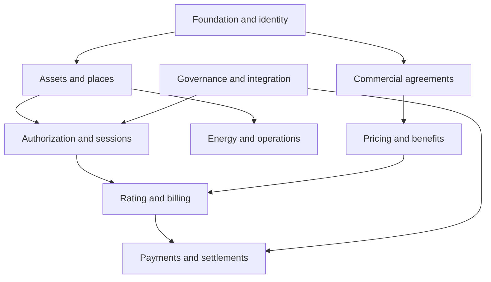

# Semantic design

## Vocabulary choices

| Vendor or overloaded term | Canonical meaning |
|---|---|
| Charge Point | `ChargingStation`: the managed physical assembly |
| EVSE | `ChargingUnit`: one logical vehicle supply capability |
| Connector | `Connector`: a physical connection option of a charging unit |
| Location | `ChargingSite`: physical place; `PublicListing` is its published description |
| Charging zone | `ChargingArea`: a subdivision of a site |
| Circuit | `ElectricalCircuit` for wiring; `LoadControlGroup` for allocation/control |
| User | `Person`, `CustomerAccount` or `Principal`, according to meaning |
| Partner | `LegalEntity`, `PartyRole` and `ServiceAgreement` |
| Operator/sub-operator | `OperatorService` and delegated authority; not automatically a legal subsidiary |
| Transaction | `ProtocolTransaction` for a wire session; `PaymentIntent`, `PaymentAuthorization` and `PaymentCapture` for money |
| Tariff | `Tariff` for the commercial identity; `TariffVersion` for an immutable price definition |
| Tariff group | `TariffSet` with ordered `TariffAssignment` records |
| RFID/id tag | `ChargingCredential` with a credential kind and assignment history |
| Energy coupon / voucher | `EnergyCoupon` is energy-denominated; `Voucher` is monetary |
| Availability | Device observation, administrative permission and measured service availability are separate facts |

## Identity, tenancy and time

Each business record has a persistent IRI, tenant, canonical identifier, creation timestamp and revision. A tenant is an isolation boundary; a legal entity is a juridical party; a brand is a customer-facing identity. Conflating them makes settlements and delegated administration ambiguous.

External identifiers carry a scheme and assigning authority. Equal integers from different APIs do not establish `owl:sameAs`. Canonical identifiers are unique within a tenant across record classes. Cross-tenant references are rejected for typed business relations. Represent a remote roaming party within the local tenant; a data-sharing service mediates access to another tenant's records.

Instants use timezone-qualified `xsd:dateTime`. Intervals are normally half-open: start inclusive, end exclusive. Reimbursement validity uses inclusive calendar dates. Local recurring windows carry an IANA timezone and an overnight flag; the reference expansion uses pinned timezone data with explicit fold/gap policies. The schema DSL's `date` and `time` aliases serialize as canonical `xsd:string` values (`YYYY-MM-DD`, `HH:MM:SS`). This avoids relying on datatypes outside the OWL 2 datatype map. SHACL checks format, ordering and actual Gregorian calendar validity (B175); the runtime integrity supplement validates timezone identifiers.

Use decimal values for money and energy. Currency, minor-unit precision, measurement unit, import/export direction, quantity thresholds and rounding policies are explicit. A negative wholesale unit price can be legitimate; imported and exported energy are separate nonnegative quantities. Do not use binary floating point for financial values.

## OWL and validation

OWL defines classes, inheritance, property types, range unions, per-class value restrictions, explicitly disjoint concepts and enumerated controlled values. Multiple possible ranges are represented by a union, because multiple global `rdfs:range` statements would assert an intersection. Global domains are deliberately avoided for reused relations: merely referencing a station should not silently classify a subject as a charging unit.

Mandatory fields and maximum cardinalities are data contracts in SHACL. OWL's open-world reasoning cannot tell you that an absent fact is an application error. Conversely, a consistent ontology does not imply a graph meets the SHACL contracts. The release includes both checks.

Classes are extensible. Shapes are not globally closed, so additional declared or external properties can coexist with the canonical model. Unknown predicates in the controlled `cd:` namespace are rejected on business records. Using an otherwise known predicate on an unrelated class is not universally prohibited by this open extension policy; applications should expose class-specific write contracts from the dictionary. This is intentional and must not be mistaken for a closed JSON schema.

Controlled values are named SKOS concepts, grouped into OWL enumeration classes. API integers and short strings are mapped at the integration boundary. State transitions for nine core lifecycle properties are explicit records referencing a reviewed transition table with 80 allowed transitions. Other lifecycle tables require an explicitly reviewed extension; scalar state fields can still be recorded and audited. The table is canonical domain policy, not a claim to reproduce External platform's internal state machine.

## Bitemporal selection

The [temporal contract](temporal-contract.md) is normative for version 1.2.0. Immutable, complete scope graphs share a valid-time and known-time context across every joined record. Commits, slices, checkpoints, aggregate boundaries, recording-time authority, query behavior and migration are specified there. `tools/temporal_store.py` is the executable reference adapter; it is not a production database.

## Versioned evidence

Tariffs, corporate policy selections, calculations, contracts and external CDRs need historical referential stability. A `TariffVersion` and the corporate policy version referenced by a `CorporateBillingSnapshot` are immutable records. A new policy version gets a new IRI; do not mutate its version tag and strand existing snapshots. An External platform mutable policy identifier is resolved to an immutable canonical version during ingestion.

`SourceEvent` retains source time, receipt time, producer, correlation and payload evidence. Clock skew needs a `ClockAssessment`; such an assessment records an explanation, not proof that the supplied correction is accurate. Evidence artifacts use content digests and storage references. A graph cannot itself prove that a referenced artifact exists or that a claimed signature was cryptographically verified.

`ChargingSession` records canonical business progress; several protocol transactions can belong to it. A command acknowledgement is not proof of physical completion. Session finalization may be device-confirmed, reconciled, partner-supplied or administrative, and carries a completeness assessment. Roaming CDRs can exist without a local charging session.

## Reuse of semantic-web standards

| Standard | Intended alignment |
|---|---|
| RDF/RDFS/OWL 2 | Graph identity, classification and logical semantics |
| SHACL Core and SHACL-SPARQL | Structural and cross-record validation |
| SKOS | Controlled terminology, labels and external code mappings |
| PROV-O | Evidence lineage, activities, agents and derivation in a deployment provenance layer |
| SOSA/SSN | `MeterObservation` can be aligned to observation concepts after choosing result and sensor modeling conventions |
| OWL-Time | `TimeWindow` can be aligned to proper intervals with explicit endpoints |
| QUDT | Use governed unit IRIs for explicit-unit quantity fields |

Only RDF/RDFS/OWL, SHACL and SKOS are normative dependencies here. PROV-O, SOSA, OWL-Time and QUDT are documented alignment directions, not untested `owl:equivalentClass` assertions. No remote ontology imports are required to build or validate this release.

## Module dependencies

The module files are partitions for review, not independently closed ontologies. Load the complete ontology for production use and Protégé. Foundation and identity concepts support all business modules; sessions and pricing connect operations to billing; payments and settlements connect billing to parties; integration and governance span the whole model.

Deferred tariff bases are represented by `baseTariffSelection`: a configured discount can resolve its base from a tariff set or roaming wholesale price later. `TariffResolution.resolvedBaseTariff` preserves the actual immutable version. B035 permits deferred configuration, while B109 requires resolved evidence before rating. Average and peak power conditions use `measurementAggregation` and explicit units rather than overloading one power threshold.
